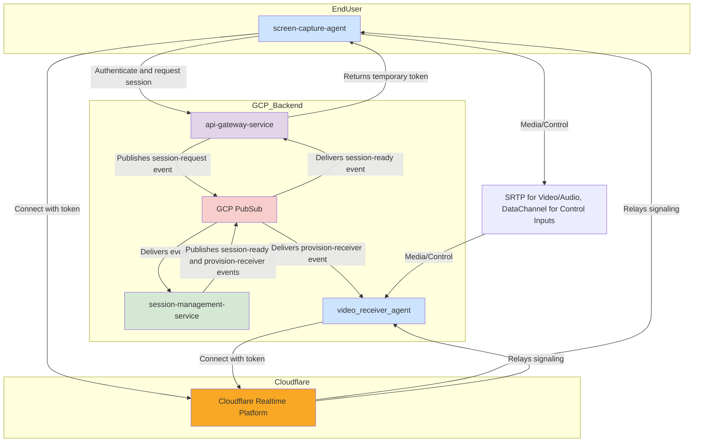

# Remote Screen-Sharing System: Architecture & Design Document

## 1. Overview

This document outlines the architecture for a high-performance, low-latency remote screen-sharing solution. The system is designed with a strong security posture and a scalable, event-driven microservice architecture for its backend components. It is composed of several custom components: a `screen-capture-agent`, a `video-receiver-agent`, a `session-management-service`, an `api-gateway-service`, and a `web-portal-service` (management portal).

The core of the transport is WebRTC, with connection orchestration handled by Cloudflare. The backend services on GCP communicate asynchronously via GCP Pub/Sub.

### 1.1. Goals and Requirements

- **High Performance:** The solution must handle high-resolution screen capture and streaming with minimal CPU overhead.
- **Low Latency:** End-to-end latency for both the media stream and the input controls must be minimized.
- **Robust Connectivity & Scalability:** The system must establish connections reliably and the backend must be scalable and resilient.
- **Security:** All agents must be authenticated before a session is established. All communication channels must be encrypted.
- **Cross-Platform:** The `screen-capture-agent` and `video-receiver-agent` should be designed with cross-platform compatibility in mind.
- **Agent Reliability:** Both agents must operate reliably across supported platforms, with minimal resource usage and seamless backend integration.
- **Agent Security:** Agents must use secure, authenticated communication with backend services and each other.
- **Management Portal (web-portal-service):**
  - Provide easy and secure management of sessions, users, and system configuration.
  - Offer real-time monitoring and observability of system health and active sessions.
  - Deliver an intuitive, modern UI for administrators, supporting efficient workflows.

## 2. Core Technologies

- **Rust:** Chosen for its performance, memory safety, and excellent concurrency features for the agent applications and backend services.
- **WebRTC (Web Real-Time Communication):** A framework that enables real-time communication of audio, video, and data. We will use both SRTP for media and DataChannels for control messages.
- **Cloudflare Realtime Platform:** A managed service providing APIs for WebRTC signaling, NAT traversal, and media relay.
- **GCP Pub/Sub:** A fully-managed, real-time messaging service that allows for sending and receiving messages between independent applications. This forms the backbone of our backend EDA.
- **Next.js (latest):** React-based web framework used for the web-portal-service, enabling server-side rendering, static site generation, and modern web app features.
- **Bun:** High-performance JavaScript/TypeScript runtime and package manager, used for building and running the web-portal-service.
- **shadcn:** Component library for building accessible, customizable UI in React/Next.js applications.
- **Tailwind CSS 4.0:** Utility-first CSS framework for rapid UI development in the web-portal-service.
- **TypeScript:** Strongly-typed superset of JavaScript, used for all frontend code in the web-portal-service to improve maintainability and reliability.

> **Note:** To ensure future flexibility, all interactions with Pub/Sub are abstracted behind standard interfaces and wrapper components. This design enables the system to support other pub/sub systems (such as AWS SNS/SQS, Apache Kafka, or RabbitMQ) with minimal changes.

## 3. System Architecture

The architecture uses a brokered authentication model and an event-driven backend. The `screen-capture-agent` makes a synchronous call to an API Gateway, which triggers an asynchronous workflow in the backend via GCP Pub/Sub.

### 3.1. Architectural Diagram

### 3.2. Backend Event-Driven Architecture (EDA) Flow

The backend services on GCP are decoupled and communicate asynchronously using GCP Pub/Sub topics. This makes the system resilient and scalable. The process for establishing a session is as follows:

1. **Request Initiation:** The `screen-capture-agent` sends a synchronous HTTPS request to the `api-gateway-service` to start a session. The gateway holds this connection open while the backend processes the request.
2. **session-request Event:** The `api-gateway-service` validates the initial request and publishes a `session-request` event to a Pub/Sub topic. This event contains the authenticated user's details and session requirements.
3. **Session Processing:** The `session-management-service`, which is subscribed to the `session-request` topic, receives the event. It performs the core business logic:
    - Interacts with the Cloudflare API to provision a new session room.
    - Generates a short-lived token for the `screen-capture-agent`.
    - Generates a short-lived token for the `video_receiver_agent`.
4. **Fan-Out Events:** Once the session is ready, the `session-management-service` publishes two distinct events to Pub/Sub:
    - A `provision-receiver` event, containing the session details and the receiver's token. This is sent to a topic that the pool of `video_receiver_agent` instances listens to.
    - A `session-ready` event, containing the session details and the `screen-capture-agent`'s token. This is sent to a response topic.
5. **Session Finalization:**
    - An available `video_receiver_agent` consumes the `provision-receiver` event and uses its token to connect to Cloudflare, ready to accept the WebRTC connection.
    - The `api-gateway-service` receives the `session-ready` event and uses the token within it to finally respond to the initial, long-held HTTPS request from the `screen-capture-agent`.

With the token received, the `screen-capture-agent` connects to Cloudflare, which then facilitates the final WebRTC handshake with the already-waiting `video_receiver_agent`.

## 4. Detailed Session Establishment Flow

This section provides a granular, step-by-step breakdown of the entire process, from initial request to active streaming.

1. **Request Session:** The `screen-capture-agent` sends an `HTTPS POST /session/create` request to the `api-gateway-service`. The request body contains its authentication credentials (e.g., an API key). The agent then waits for a response.
2. **Publish Request Event:** The `api-gateway-service` authenticates the credentials. If valid, it publishes a `session-request` message to the `session-requests` GCP Pub/Sub topic. The message payload is a JSON object like: `{ "clientId": "...", "authDetails": "..." }`.
3. **Consume Request & Provision Session:** The `session-management-service` receives the `session-request` message. It performs the core logic:
    - Calls the Cloudflare API to create a new session room.
    - Generates a short-lived, single-use token for the `screen-capture-agent`.
    - Generates a separate short-lived, single-use token for the `video_receiver_agent`.
4. **Publish Provisioning Event:** The `session-management-service` publishes a `provision-receiver` message to the `receiver-provisioning` Pub/Sub topic. The payload is a JSON object: `{ "sessionId": "...", "receiverToken": "...", "cloudflareRoomId": "..." }`.
5. **Publish Ready Event:** The `session-management-service` publishes a `session-ready` message to a `session-responses` Pub/Sub topic (which the gateway is subscribed to). The payload is a JSON object: `{ "sessionId": "...", "clientToken": "...", "cloudflareRoomId": "..." }`.
6. **Receiver Connects:** An available `video_receiver_agent` instance consumes the message from the `receiver-provisioning` topic. It uses its `receiverToken` to connect to the specified Cloudflare room and waits for a peer to join.
7. **Gateway Responds:** The `api-gateway-service` consumes the `session-ready` message. It finds the original pending HTTPS request and sends a `200 OK` response. The body of the response contains the `clientToken` and `cloudflareRoomId`.
8. **Client Connects:** The `screen-capture-agent` receives the `200 OK` response. It now has the token needed to connect. It uses its `clientToken` to connect to the specified Cloudflare room.
9. **WebRTC Handshake:** Since both peers are now connected to the same Cloudflare room, Cloudflare's signaling service facilitates the WebRTC handshake (exchanging SDP offers/answers and ICE candidates) between them.
10. **Peer Connection Established:** The handshake completes, and a direct, encrypted WebRTC peer connection is established between the `screen-capture-agent` and the `video_receiver_agent`.
11. **Streaming Begins:** The `screen-capture-agent` starts sending its captured video and audio over the SRTP media stream and its captured mouse/keyboard inputs over the established DataChannel to the `video_receiver_agent`. The session is now fully active.

## 5. Component Definitions and Execution Environments

### 5.1. screen-capture-agent
- **Language:** Rust
- **Role:** Captures the user's screen, encodes video/audio, and sends it via WebRTC. Authenticates with the API Gateway to initiate a session.
- **Environment:** Runs on end-user machines (Windows, macOS, Linux).

### 5.2. api-gateway-service
- **Language:** Rust
- **Role:** Synchronous HTTP API for session initiation. Authenticates agents, bridges to the event-driven backend, and returns session tokens.
- **Environment:** Deployed as a stateless microservice on GCP (Cloud Run, GKE, or similar).

### 5.3. session-management-service
- **Language:** Rust
- **Role:** Handles session orchestration, token generation, and Cloudflare API integration. Publishes events for session provisioning.
- **Environment:** Deployed as a stateless microservice on GCP.

### 5.4. video_receiver_agent
- **Language:** Rust
- **Role:** Connects to Cloudflare as a WebRTC peer, receives video/audio, and processes control inputs.
- **Environment:** Runs on GCP or other cloud infrastructure.

### 5.5. web-portal-service
- **Language:** TypeScript
- **Framework:** Next.js (latest stack), Bun, shadcn, Tailwind CSS 4.0
- **Role:** Provides a management portal for system administration, monitoring, and configuration.
- **Environment:** Hosted on GCP Cloud Run as a stateless web application.

## 6. Recommended Rust Crates

- `tokio`: Asynchronous runtime for Rust.
- `serde` / `serde_json`: Serialization/deserialization of JSON payloads.
- `webrtc`: WebRTC implementation in Rust.
- `reqwest`: HTTP client for API calls (e.g., to Cloudflare).
- `jsonwebtoken`: For creating and validating JWTs for session tokens.
- `google-cloud-pubsub`: GCP Pub/Sub integration.
- `tracing`: Structured logging and distributed tracing.

## 7. Architectural Decision Records (ADRs)

Architectural Decision Records (ADRs) capture important architectural choices made during the design and development of this system. Each ADR documents the context, the decision taken, and the rationale behind it. This ensures that the reasoning for key decisions is preserved for future reference, onboarding, and system evolution.

### ADR-001: Choice of Primary Programming Language

- **Decision:** Use Rust for all custom-built components.
- **Reason:** The project requires high performance, memory safety, and strong concurrency for real-time media processing and scalable backend services.

### ADR-002: Media and Control Transport

- **Decision:** Use WebRTC for all real-time communication between the `screen-capture-agent` and the `video_receiver_agent`. Specifically, SRTP for media (video/audio) and a DataChannel for control inputs (mouse/keyboard).
- **Reason:** WebRTC is the standard for low-latency, encrypted, peer-to-peer communication. Using a DataChannel for control messages ensures they travel on the same optimized path as the media, minimizing latency.

### ADR-003: Signaling and NAT Traversal Provider

- **Decision:** Use the managed Cloudflare Realtime Platform for all WebRTC signaling, NAT traversal (STUN/TURN), and media relay services.
- **Reason:** This drastically simplifies the architecture by outsourcing complex backend infrastructure. It eliminates significant development and operational overhead, provides global scalability, and accelerates time-to-market.

### ADR-004: Backend Communication Style

- **Decision:** Adopt an Event-Driven Architecture (EDA) using GCP Pub/Sub for all communication between backend services.
- **Reason:** This decouples services, allowing them to be developed, deployed, and scaled independently. It improves the overall resilience and flexibility of the backend system.

### ADR-005: System Decomposition

- **Decision:** The custom-built portion of the system is composed of four distinct microservices: `screen-capture-agent`, `api-gateway-service`, `session-management-service`, and `video_receiver_agent`.
- **Reason:** This decomposition aligns with the EDA, with each service having a clear, single responsibility (capturing, bridging, managing, receiving).

### ADR-006: Synchronous-to-Asynchronous Bridge

- **Decision:** Introduce an `api-gateway-service` to act as the sole entry point for external clients.
- **Reason:** The `screen-capture-agent` requires a simple, synchronous request/response flow to initiate a session. The `api-gateway-service` provides this synchronous facade, hiding the complexity of the asynchronous, event-driven backend.

### ADR-007: Brokered Authentication Model

- **Decision:** Implement a `session-management-service` that acts as a central authority for authenticating agents and issuing short-lived session tokens.
- **Reason:** This provides a secure-by-default model. Client applications never handle long-lived credentials. It centralizes control, allowing for robust auditing and policy enforcement.

### ADR-008: Data Serialization Format

- **Decision:** Use JSON for all event payloads in GCP Pub/Sub and for API communication.
- **Reason:** JSON is universally supported, human-readable for debugging, and well-supported by the Rust *serde* library.

### ADR-009: Cloud Provider Selection

- **Decision:** Use Google Cloud Platform (GCP) for all backend infrastructure and managed services.
- **Reason:** GCP provides robust managed services (Pub/Sub, Cloud Run, GKE) that align with the system’s event-driven, microservice-based architecture. It offers global scalability, security, and seamless integration with other required services.

### ADR-010: Stateless Microservice Design

- **Decision:** All backend services are designed to be stateless.
- **Reason:** Stateless services are easier to scale, recover, and deploy. They align with cloud-native best practices and simplify horizontal scaling and failover.

### ADR-011: Security Practices and Token Management

- **Decision:** All communication is encrypted, and only short-lived, single-use tokens are issued for session authentication.
- **Reason:** This minimizes the risk of credential leakage, supports zero-trust principles, and ensures that compromised tokens have minimal impact.

### ADR-012: Cross-Platform Agent Support

- **Decision:** The screen-capture-agent is designed to run on Windows, macOS, and Linux.
- **Reason:** Supporting all major desktop platforms maximizes the system’s applicability and user base.

### ADR-013: Observability and Tracing

- **Decision:** Use structured logging and distributed tracing across all services.
- **Reason:** This enables effective monitoring, debugging, and performance analysis in a distributed, event-driven system.

### ADR-014: Pub/Sub Abstraction Layer

- **Decision:** Abstract all interactions with GCP Pub/Sub behind standard interfaces and wrapper components.
- **Reason:** This enables the system to be easily adapted to use other pub/sub systems in the future (e.g., AWS SNS/SQS, Apache Kafka, RabbitMQ) with minimal code changes, increasing portability and reducing vendor lock-in.

### ADR-015: Web Portal Service and Tech Stack

- **Decision:** Introduce a new service, `web-portal-service`, implemented as a Next.js application using Bun, shadcn, Tailwind CSS 4.0, and TypeScript. Deploy this service on GCP Cloud Run.
- **Reason:** This provides a modern, maintainable, and highly interactive management portal for system administrators. The chosen stack ensures rapid development, excellent developer experience, and seamless cloud-native deployment.