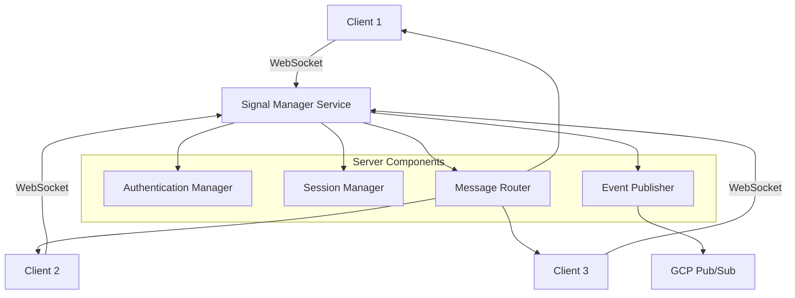
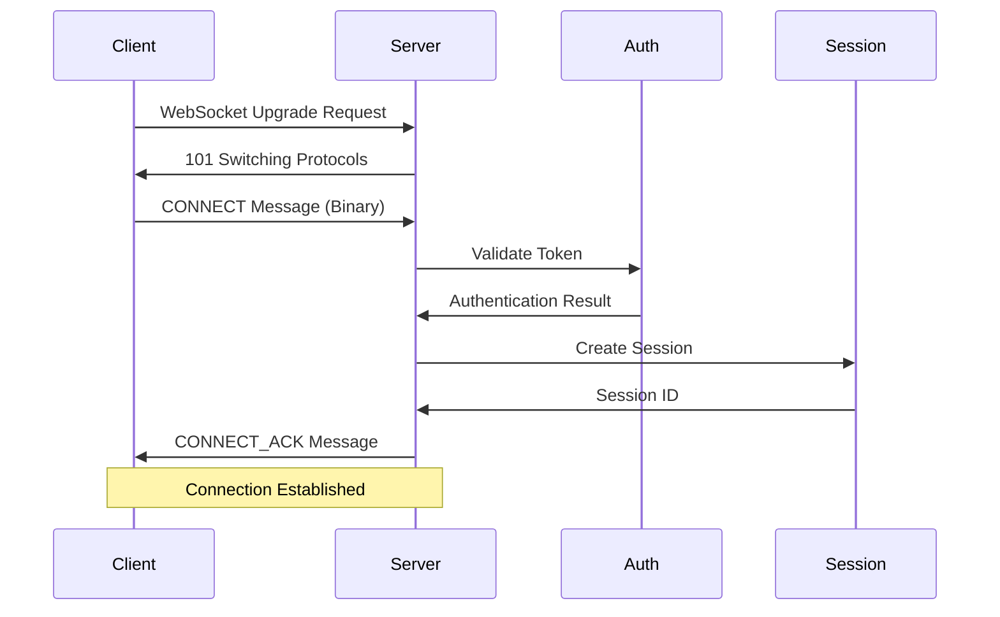
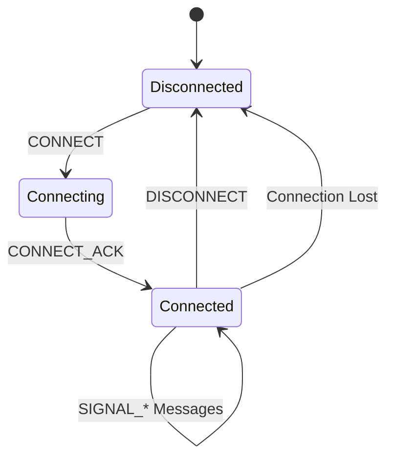
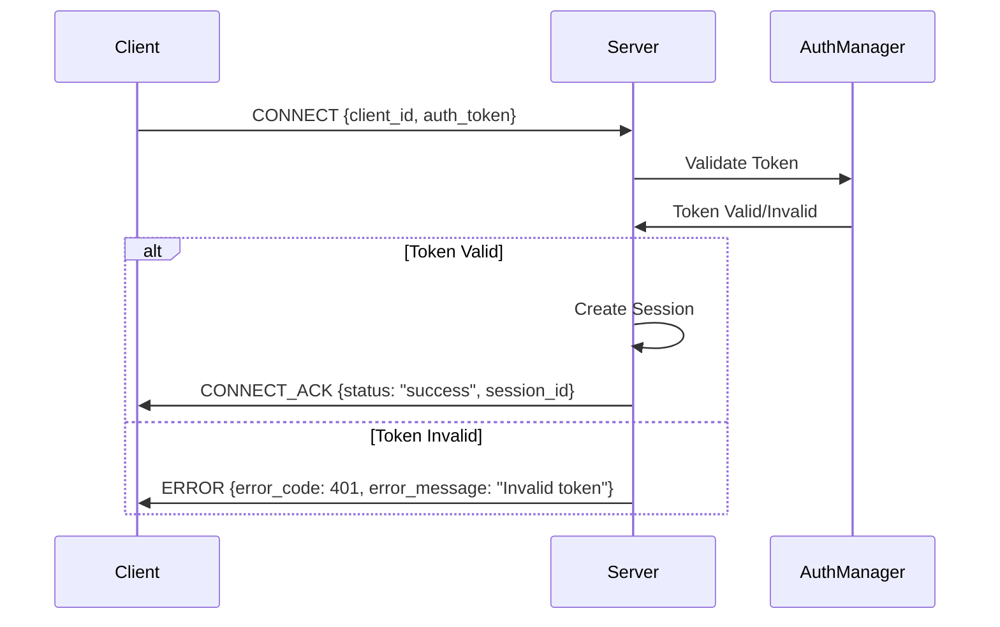
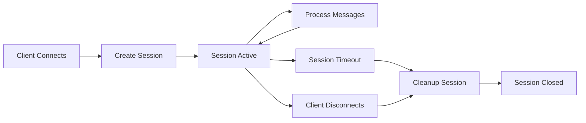
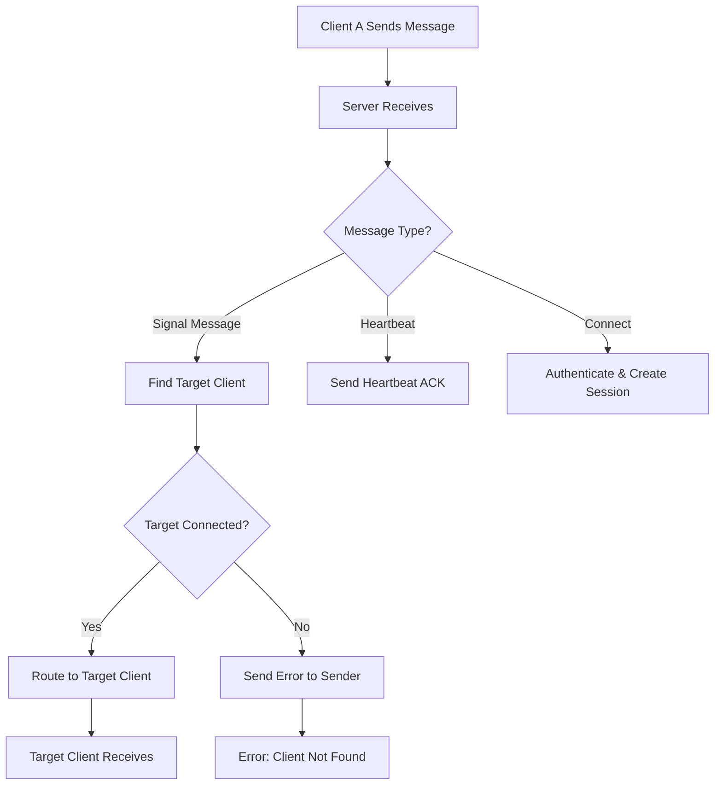

# Signal Manager Service Protocol Documentation

## Overview

The Signal Manager Service is a high-performance WebSocket server designed to facilitate real-time communication between agents and backend services. It implements a custom binary protocol optimized for signaling operations, particularly useful for WebRTC applications and real-time data exchange.

## Table of Contents

1. [Introduction](#introduction)
2. [Architecture Overview](#architecture-overview)
3. [WebSocket Endpoint](#websocket-endpoint)
4. [Binary Protocol Specification](#binary-protocol-specification)
5. [Message Types](#message-types)
6. [Authentication Flow](#authentication-flow)
7. [Session Management](#session-management)
8. [Message Routing](#message-routing)
9. [Error Handling](#error-handling)
10. [Examples](#examples)

## Introduction

The Signal Manager Service acts as a central hub for real-time communication between multiple clients. It's designed to handle:

- **WebSocket Connections**: Secure, persistent connections for real-time communication
- **Binary Protocol**: Efficient message format for minimal overhead
- **Authentication**: Token-based client authentication
- **Session Management**: Track and manage client sessions
- **Message Routing**: Route messages between connected clients
- **Heartbeat Monitoring**: Keep connections alive and detect failures

## Architecture Overview



## WebSocket Endpoint

### Connection Details

- **Protocol**: WebSocket (ws:// or wss:// for TLS)
- **Default Host**: `127.0.0.1`
- **Default Port**: `8080`
- **Path**: `/` (root path)
- **Message Format**: Binary frames

### Connection URL Examples

```bash
# Plain WebSocket (development)
ws://127.0.0.1:8080/

# Secure WebSocket (production)
wss://your-domain.com:8080/
```

### Connection Flow



## Binary Protocol Specification

The service uses a custom binary protocol for efficient message exchange. Each message follows this structure:

```
[Start Byte (1 byte)] [Message Type (1 byte)] [UUID (16 bytes)] [Payload Type (1 byte)] [Payload Length (2 bytes)] [Payload (N bytes)]
```

### Message Structure Breakdown

| Field | Size | Description |
|-------|------|-------------|
| Start Byte | 1 byte | Always `0xAA` (170) |
| Message Type | 1 byte | Message type identifier |
| UUID | 16 bytes | Unique message identifier |
| Payload Type | 1 byte | Payload encoding type |
| Payload Length | 2 bytes | Payload size in bytes (big-endian) |
| Payload | N bytes | Actual message data |

### Binary Message Example

```rust
// Example: CONNECT message with JSON payload
let message_bytes = [
    0xAA,                    // Start byte
    0x01,                    // Message type (CONNECT)
    // UUID (16 bytes)...
    0x02,                    // Payload type (JSON)
    0x00, 0x2A,             // Payload length (42 bytes)
    // JSON payload...
];
```

## Message Types

The protocol supports several message types for different operations:

### Core Message Types

| Type | Value | Description |
|------|-------|-------------|
| CONNECT | 0x01 | Client connection request |
| CONNECT_ACK | 0x02 | Connection acknowledgment |
| DISCONNECT | 0x03 | Client disconnection |
| HEARTBEAT | 0x04 | Keep-alive heartbeat |
| HEARTBEAT_ACK | 0x05 | Heartbeat acknowledgment |
| ERROR | 0xFF | Error message |

### Signaling Message Types

| Type | Value | Description |
|------|-------|-------------|
| SIGNAL_OFFER | 0x10 | WebRTC offer signal |
| SIGNAL_ANSWER | 0x11 | WebRTC answer signal |
| SIGNAL_ICE_CANDIDATE | 0x12 | ICE candidate signal |

### Message Flow Diagram



## Authentication Flow

The service uses token-based authentication for client connections.

### Authentication Process



### Authentication Payload

```json
{
  "client_id": "client_123",
  "auth_token": "valid_auth_token"
}
```

### Test Credentials

For development and testing, the following credentials are available:

- **Client ID**: `test_client_1`, **Token**: `test_token_1`
- **Client ID**: `test_client_2`, **Token**: `test_token_2`

## Session Management

The service maintains session state for each connected client.

### Session Information

- **Session ID**: Unique identifier for each session
- **Client ID**: Identifier for the connected client
- **Connection Time**: When the session was established
- **Last Activity**: Timestamp of last message
- **Message Count**: Number of messages processed

### Session Lifecycle



## Message Routing

The service routes messages between connected clients based on target client IDs.

### Routing Process



### Signal Message Routing

For signaling messages (SIGNAL_OFFER, SIGNAL_ANSWER, SIGNAL_ICE_CANDIDATE):

1. **Sender** sends message with target client ID
2. **Server** looks up target client in active sessions
3. **Server** routes message to target client if connected
4. **Target** receives and processes the signal

## Error Handling

The service provides comprehensive error handling and reporting.

### Error Types

| Error Code | Description |
|------------|-------------|
| 400 | Bad Request - Invalid message format |
| 401 | Unauthorized - Invalid authentication |
| 404 | Not Found - Target client not connected |
| 500 | Internal Server Error |

### Error Message Format

```json
{
  "error_code": 404,
  "error_message": "Target client not found"
}
```

## Examples

### 1. Basic Connection

```javascript
// JavaScript WebSocket client example
const ws = new WebSocket('ws://127.0.0.1:8080/');

ws.onopen = function() {
    // Send CONNECT message
    const connectMessage = {
        message_type: 0x01, // CONNECT
        uuid: "550e8400-e29b-41d4-a716-446655440000",
        payload_type: 0x02, // JSON
        payload: {
            client_id: "test_client_1",
            auth_token: "test_token_1"
        }
    };
    
    // Convert to binary and send
    const binaryData = messageToBinary(connectMessage);
    ws.send(binaryData);
};
```

### 2. Sending a Signal

```javascript
// Send signal to another client
const signalMessage = {
    message_type: 0x10, // SIGNAL_OFFER
    uuid: "550e8400-e29b-41d4-a716-446655440001",
    payload_type: 0x02, // JSON
    payload: {
        target_client_id: "client_2",
        signal_data: "base64_encoded_webrtc_offer"
    }
};

const binaryData = messageToBinary(signalMessage);
ws.send(binaryData);
```

### 3. Heartbeat

```javascript
// Send heartbeat every 30 seconds
setInterval(() => {
    const heartbeatMessage = {
        message_type: 0x04, // HEARTBEAT
        uuid: "550e8400-e29b-41d4-a716-446655440002",
        payload_type: 0x02, // JSON
        payload: {
            timestamp: Date.now()
        }
    };
    
    const binaryData = messageToBinary(heartbeatMessage);
    ws.send(binaryData);
}, 30000);
```

## Configuration

The service can be configured using TOML files or environment variables.

### Configuration File (app-config.toml)

```toml
[server]
host = "127.0.0.1"
port = 8080
max_connections = 1000
heartbeat_interval = 30
tls_enabled = false

[auth]
token_secret = "your-secret-key-change-in-production"
token_expiry = 3600
auth_method = "token"
api_keys = [
    "test_client_1:test_token_1",
    "test_client_2:test_token_2"
]

[logging]
level = "info"
format = "json"
console_output = true

[metrics]
enabled = true
port = 9090
host = "127.0.0.1"
```

### Environment Variables

```bash
export SIGNAL_MANAGER_SERVER_HOST="0.0.0.0"
export SIGNAL_MANAGER_SERVER_PORT="8080"
export SIGNAL_MANAGER_AUTH_TOKEN_SECRET="your-secret"
export SIGNAL_MANAGER_LOGGING_LEVEL="info"
```

## Performance Considerations

### Connection Limits

- **Default Max Connections**: 1,000
- **Message Buffer Size**: 8,192 bytes
- **Max Message Size**: 1,048,576 bytes (1MB)

### Monitoring

The service provides metrics for monitoring:

- **Connection Count**: Number of active connections
- **Message Rate**: Messages per second
- **Error Rate**: Error messages per second
- **Session Duration**: Average session length

## Security

### TLS Support

The service supports TLS encryption for secure communication:

```toml
[server]
tls_enabled = true
tls_cert_path = "/path/to/certificate.pem"
tls_key_path = "/path/to/private_key.pem"
```

### Authentication Best Practices

1. **Use Strong Tokens**: Generate cryptographically secure tokens
2. **Token Expiration**: Set reasonable token expiration times
3. **TLS in Production**: Always use TLS in production environments
4. **Rate Limiting**: Implement rate limiting for connection attempts

## Troubleshooting

### Common Issues

1. **Connection Refused**: Check if server is running and port is accessible
2. **Authentication Failed**: Verify client credentials
3. **Message Not Delivered**: Ensure target client is connected
4. **Connection Drops**: Check heartbeat configuration

### Debug Mode

Enable debug logging for troubleshooting:

```toml
[logging]
level = "debug"
```

## Conclusion

The Signal Manager Service provides a robust, high-performance solution for real-time communication between clients. Its binary protocol ensures efficient message exchange, while its modular architecture allows for easy extension and customization.

For more information, refer to the source code and test examples in the project repository. 