# Signal Manager Service Protocol Documentation

## Overview

The Signal Manager Service is a high-performance WebSocket server designed to facilitate real-time communication between agents and backend services. It implements a custom binary protocol optimized for signaling operations, particularly useful for WebRTC applications and real-time data exchange.

## Table of Contents

1. [Introduction](#introduction)
2. [Architecture Overview](#architecture-overview)
3. [WebSocket Endpoint](#websocket-endpoint)
4. [Binary Protocol Specification](#binary-protocol-specification)
5. [Message Types](#message-types)
6. [Authentication Flow](#authentication-flow)
7. [Session Management](#session-management)
8. [Message Routing](#message-routing)
9. [Error Handling](#error-handling)
10. [Use Cases and Sequence Diagrams](#use-cases-and-sequence-diagrams)
11. [Examples](#examples)
12. [Configuration](#configuration)
13. [Performance Considerations](#performance-considerations)
14. [Security](#security)
15. [Troubleshooting](#troubleshooting)

## Introduction

The Signal Manager Service acts as a central hub for real-time communication between multiple clients. It's designed to handle:

- **WebSocket Connections**: Secure, persistent connections for real-time communication
- **Binary Protocol**: Efficient message format for minimal overhead
- **Authentication**: Token-based client authentication
- **Session Management**: Track and manage client sessions
- **Message Routing**: Route messages between connected clients
- **Heartbeat Monitoring**: Keep connections alive and detect failures
- **Client Registration**: Register and unregister clients with the service
- **WebRTC Signaling**: Facilitate WebRTC peer-to-peer connections

## Architecture Overview

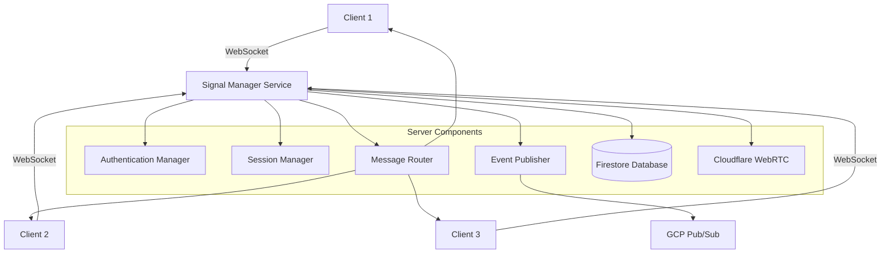

## WebSocket Endpoint

### Connection Details

- **Protocol**: WebSocket (ws:// or wss:// for TLS)
- **Default Host**: `127.0.0.1`
- **Default Port**: `8080`
- **Path**: `/` (root path)
- **Message Format**: Binary frames

### Connection URL Examples

```bash
# Plain WebSocket (development)
ws://127.0.0.1:8080/

# Secure WebSocket (production)
wss://your-domain.com:8080/
```

### Connection Flow

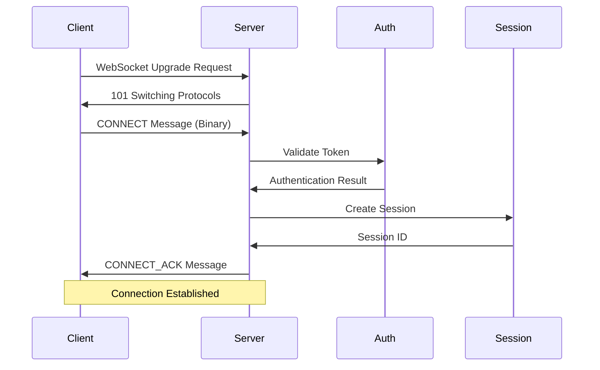

## Binary Protocol Specification

The service uses a custom binary protocol for efficient message exchange. Each message follows this structure:

```
[Start Byte (1 byte)] [Message Type (1 byte)] [UUID (16 bytes)] [Payload Type (1 byte)] [Payload Length (2 bytes)] [Payload (N bytes)]
```

### Message Structure Breakdown

| Field | Size | Description |
|-------|------|-------------|
| Start Byte | 1 byte | Always `0xAA` (170) |
| Message Type | 1 byte | Message type identifier |
| UUID | 16 bytes | Unique message identifier |
| Payload Type | 1 byte | Payload encoding type |
| Payload Length | 2 bytes | Payload size in bytes (big-endian) |
| Payload | N bytes | Actual message data |

### Binary Message Example

```rust
// Example: REGISTER message with JSON payload
let message_bytes = [
    0xAA,                    // Start byte
    0x20,                    // Message type (REGISTER)
    // UUID (16 bytes)...
    0x02,                    // Payload type (JSON)
    0x00, 0x2A,             // Payload length (42 bytes)
    // JSON payload...
];
```

## Message Types

The protocol supports several message types for different operations:

### Core Message Types

| Type | Value | Description | Direction |
|------|-------|-------------|-----------|
| CONNECT | 0x01 | Client connection request | Client → Server |
| CONNECT_ACK | 0x02 | Connection acknowledgment | Server → Client |
| DISCONNECT | 0x03 | Client disconnection | Client → Server |
| PING | 0x04 | Keep-alive ping | Client → Server |
| PING_ACK | 0x05 | Ping acknowledgment | Server → Client |
| ERROR | 0xFF | Error message | Server → Client |

### Registration Message Types

| Type | Value | Description | Direction |
|------|-------|-------------|-----------|
| REGISTER | 0x20 | Client registration request | Client → Server |
| REGISTER_ACK | 0x21 | Registration acknowledgment | Server → Client |
| UNREGISTER | 0x22 | Client unregistration request | Client → Server |
| UNREGISTER_ACK | 0x23 | Unregistration acknowledgment | Server → Client |

### WebRTC Signaling Message Types

| Type | Value | Description | Direction |
|------|-------|-------------|-----------|
| ROOM_CREATE | 0x30 | Create WebRTC room | Client → Server |
| ROOM_CREATE_ACK | 0x31 | Room creation acknowledgment | Server → Client |
| ROOM_JOIN | 0x32 | Join WebRTC room | Client → Server |
| ROOM_JOIN_ACK | 0x33 | Room join acknowledgment | Server → Client |
| ROOM_LEAVE | 0x34 | Leave WebRTC room | Client → Server |
| ROOM_LEAVE_ACK | 0x35 | Room leave acknowledgment | Server → Client |

### Message Flow Diagram

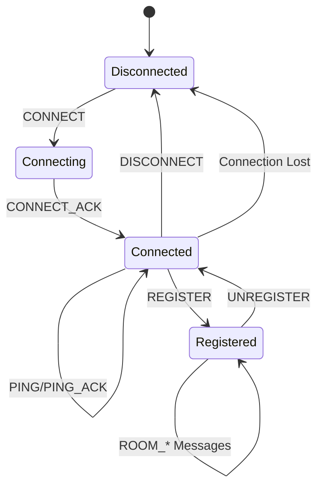

## Message Payloads and Parameters

### CONNECT Message

**Direction**: Client → Server  
**Purpose**: Establish initial connection and authenticate client

```json
{
  "client_id": "user-agent-123",
  "auth_token": "auth-token-456",
  "version": "1.0.0",
  "capabilities": ["websocket", "heartbeat", "webrtc"],
  "metadata": {
    "userAgent": "Mozilla/5.0 (Windows NT 10.0; Win64; x64) AppleWebKit/537.36",
    "platform": "web",
    "timestamp": 1704110400000
  }
}
```

**Parameters**:
- `client_id` (string, required): Unique identifier for the client
- `auth_token` (string, required): Authentication token for client validation
- `version` (string, required): Protocol version (must be ≤ server version)
- `capabilities` (array, optional): List of client capabilities
- `metadata` (object, optional): Additional client information

### CONNECT_ACK Message

**Direction**: Server → Client  
**Purpose**: Acknowledge successful connection

```json
{
  "status": 200,
  "message": "Connection established",
  "session_id": "550e8400-e29b-41d4-a716-446655440000",
  "server_version": "1.0.0",
  "heartbeat_interval": 30,
  "capabilities": ["websocket", "heartbeat", "webrtc"]
}
```

**Parameters**:
- `status` (number, required): HTTP-style status code (200 = success)
- `message` (string, optional): Human-readable status message
- `session_id` (string, required): Unique session identifier
- `server_version` (string, required): Server protocol version
- `heartbeat_interval` (number, required): Recommended heartbeat interval in seconds
- `capabilities` (array, optional): Server-supported capabilities

### REGISTER Message

**Direction**: Client → Server  
**Purpose**: Register client with the service for persistent storage

```json
{
  "version": "1.0.0",
  "client_id": "user-agent-123",
  "auth_token": "auth-token-456",
  "room_id": null,
  "capabilities": ["websocket", "heartbeat", "webrtc"],
  "metadata": {
    "userAgent": "Mozilla/5.0 (Windows NT 10.0; Win64; x64) AppleWebKit/537.36",
    "platform": "web",
    "timestamp": 1704110400000,
    "features": ["video", "audio", "screen-sharing"]
  }
}
```

**Parameters**:
- `version` (string, required): Protocol version
- `client_id` (string, required): Unique client identifier
- `auth_token` (string, required): Authentication token
- `room_id` (string, optional): Associated room ID if joining existing room
- `capabilities` (array, optional): Client capabilities
- `metadata` (object, optional): Additional client metadata

### REGISTER_ACK Message

**Direction**: Server → Client  
**Purpose**: Acknowledge successful client registration

```json
{
  "version": "1.0.0",
  "status": 200,
  "message": "Registration successful",
  "client_id": "user-agent-123",
  "session_id": "550e8400-e29b-41d4-a716-446655440000"
}
```

**Parameters**:
- `version` (string, required): Protocol version
- `status` (number, required): Status code (200 = success, 4xx/5xx = error)
- `message` (string, optional): Status message
- `client_id` (string, optional): Confirmed client ID
- `session_id` (string, optional): WebRTC session ID for media streaming

### UNREGISTER Message

**Direction**: Client → Server  
**Purpose**: Unregister client from the service

```json
{
  "version": "1.0.0",
  "client_id": "user-agent-123",
  "auth_token": "auth-token-456"
}
```

**Parameters**:
- `version` (string, required): Protocol version
- `client_id` (string, required): Client identifier to unregister
- `auth_token` (string, required): Authentication token for validation

### UNREGISTER_ACK Message

**Direction**: Server → Client  
**Purpose**: Acknowledge successful client unregistration

```json
{
  "version": "1.0.0",
  "status": 200,
  "message": "Unregistration successful",
  "client_id": "user-agent-123"
}
```

**Parameters**:
- `version` (string, required): Protocol version
- `status` (number, required): Status code (200 = success, 4xx/5xx = error)
- `message` (string, optional): Status message
- `client_id` (string, optional): Confirmed client ID

### PING Message

**Direction**: Client → Server  
**Purpose**: Keep-alive heartbeat to maintain connection

```json
{
  "timestamp": 1704110400000
}
```

**Parameters**:
- `timestamp` (number, required): Current timestamp in milliseconds

### PING_ACK Message

**Direction**: Server → Client  
**Purpose**: Acknowledge ping and provide server timestamp

```json
{
  "timestamp": 1704110400000,
  "server_time": 1704110400000
}
```

**Parameters**:
- `timestamp` (number, required): Echo of client timestamp
- `server_time` (number, required): Server timestamp for clock synchronization

### ROOM_CREATE Message

**Direction**: Client → Server  
**Purpose**: Create a new WebRTC room for media streaming

```json
{
  "version": "1.0.0",
  "client_id": "user-agent-123",
  "auth_token": "auth-token-456",
  "room_id": "room-123",
  "offer_sdp": "v=0\r\no=- 1234567890 2 IN IP4 127.0.0.1\r\ns=-\r\nt=0 0\r\na=group:BUNDLE 0\r\n...",
  "capabilities": ["video", "audio"],
  "metadata": {
    "room_name": "Meeting Room 1",
    "max_participants": 10,
    "recording_enabled": false
  }
}
```

**Parameters**:
- `version` (string, required): Protocol version
- `client_id` (string, required): Client creating the room
- `auth_token` (string, required): Authentication token
- `room_id` (string, optional): Custom room ID (auto-generated if not provided)
- `offer_sdp` (string, required): WebRTC offer SDP
- `capabilities` (array, optional): Media capabilities
- `metadata` (object, optional): Room metadata

### ROOM_CREATE_ACK Message

**Direction**: Server → Client  
**Purpose**: Acknowledge room creation and provide connection info

```json
{
  "version": "1.0.0",
  "status": 200,
  "message": "Room created successfully",
  "room_id": "room-123",
  "session_id": "550e8400-e29b-41d4-a716-446655440000",
  "connection_info": {
    "room_id": "room-123",
    "role": "sender",
    "app_id": "cloudflare-app-id",
    "session_id": "550e8400-e29b-41d4-a716-446655440000",
    "status": "connecting",
    "metadata": {
      "session_id": "550e8400-e29b-41d4-a716-446655440000",
      "created_at": "2024-01-01T12:00:00Z",
      "client_id": "user-agent-123"
    }
  }
}
```

**Parameters**:
- `version` (string, required): Protocol version
- `status` (number, required): Status code
- `message` (string, optional): Status message
- `room_id` (string, required): Room identifier
- `session_id` (string, required): Cloudflare session ID
- `connection_info` (object, required): WebRTC connection information

### ERROR Message

**Direction**: Server → Client  
**Purpose**: Report errors to client

```json
{
  "error_code": 401,
  "error_message": "Invalid authentication token",
  "details": {
    "client_id": "user-agent-123",
    "timestamp": 1704110400000
  }
}
```

**Parameters**:
- `error_code` (number, required): Error code (4xx/5xx)
- `error_message` (string, required): Human-readable error message
- `details` (object, optional): Additional error details

## Authentication Flow

The service uses token-based authentication for client connections.

### Authentication Process

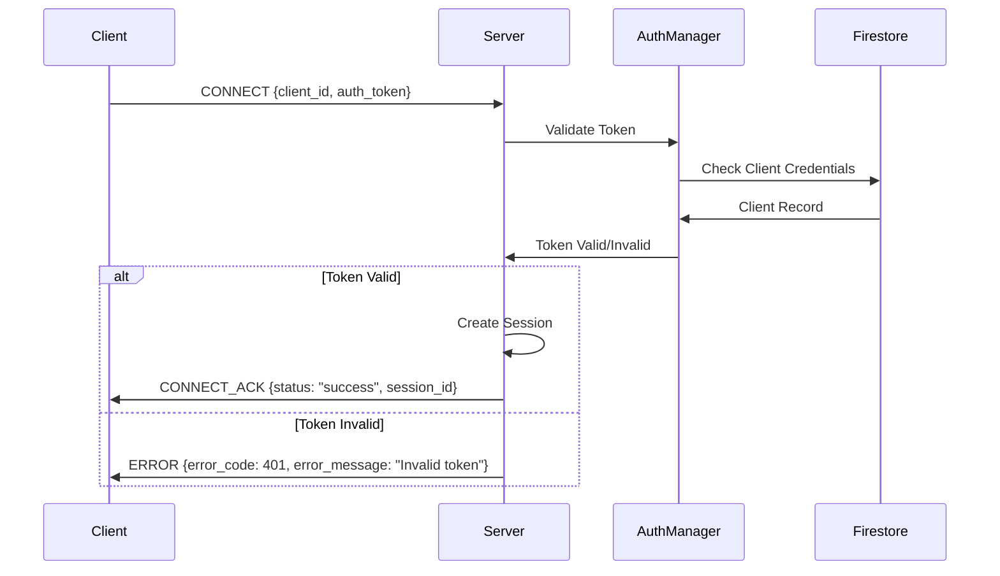

### Authentication Payload

```json
{
  "client_id": "user-agent-123",
  "auth_token": "valid_auth_token"
}
```

### Test Credentials

For development and testing, the following credentials are available:

- **Client ID**: `test_client_1`, **Token**: `test_token_1`
- **Client ID**: `test_client_2`, **Token**: `test_token_2`

## Session Management

The service maintains session state for each connected client.

### Session Information

- **Session ID**: Unique identifier for each session
- **Client ID**: Identifier for the connected client
- **Connection Time**: When the session was established
- **Last Activity**: Timestamp of last message
- **Message Count**: Number of messages processed
- **Registration Status**: Whether client is registered
- **Room Association**: Current room the client is in

### Session Lifecycle

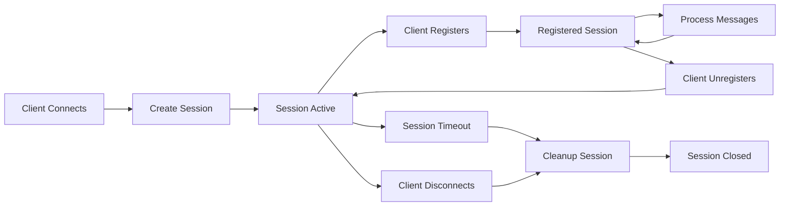

## Message Routing

The service routes messages between connected clients based on target client IDs.

### Routing Process

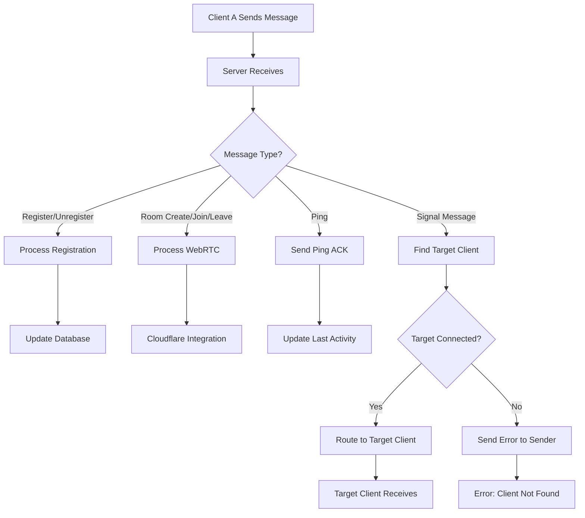

## Error Handling

The service provides comprehensive error handling and reporting.

### Error Types

| Error Code | Description | Resolution |
|------------|-------------|------------|
| 400 | Bad Request - Invalid message format | Check message structure |
| 401 | Unauthorized - Invalid authentication | Verify client credentials |
| 404 | Not Found - Target client not connected | Ensure target is online |
| 409 | Conflict - Client already registered | Unregister first |
| 500 | Internal Server Error | Check server logs |
| 503 | Service Unavailable - Database/Cloudflare error | Retry later |

### Error Message Format

```json
{
  "error_code": 404,
  "error_message": "Target client not found",
  "details": {
    "target_client_id": "client_2",
    "timestamp": 1704110400000
  }
}
```

## Use Cases and Sequence Diagrams

### 1. Client Registration Flow

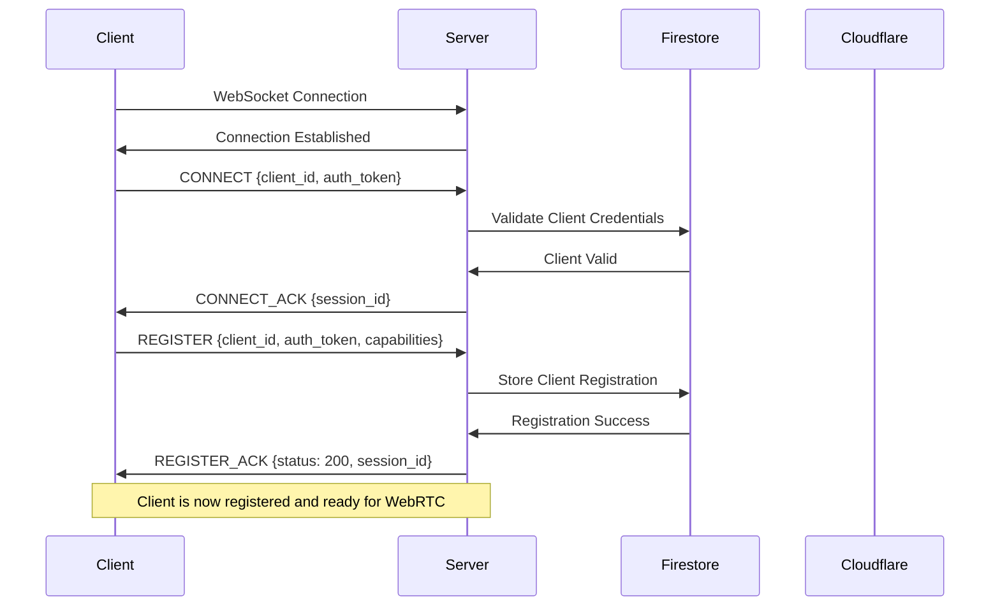

### 2. WebRTC Room Creation Flow

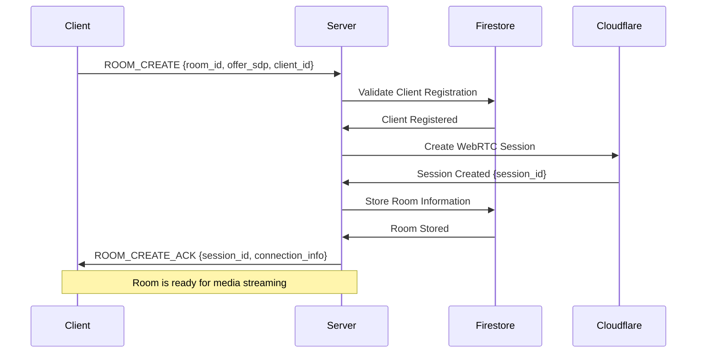

### 3. Client Unregistration Flow

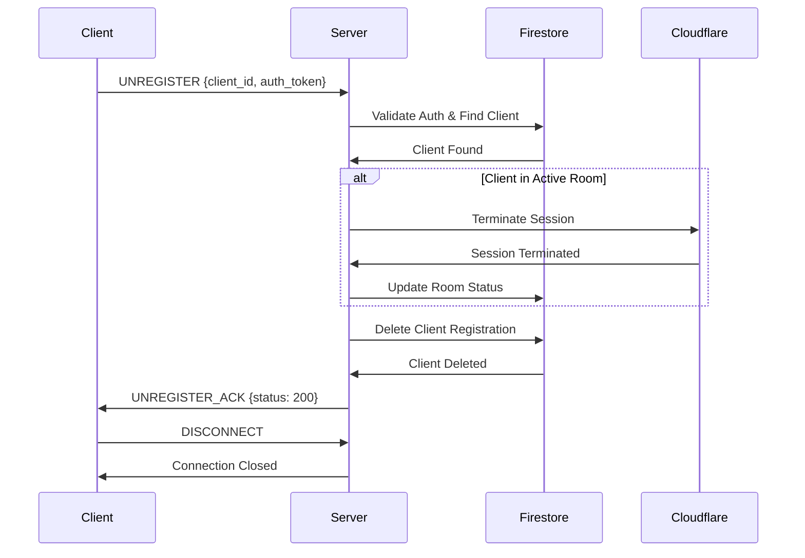

### 4. Heartbeat/Ping Flow

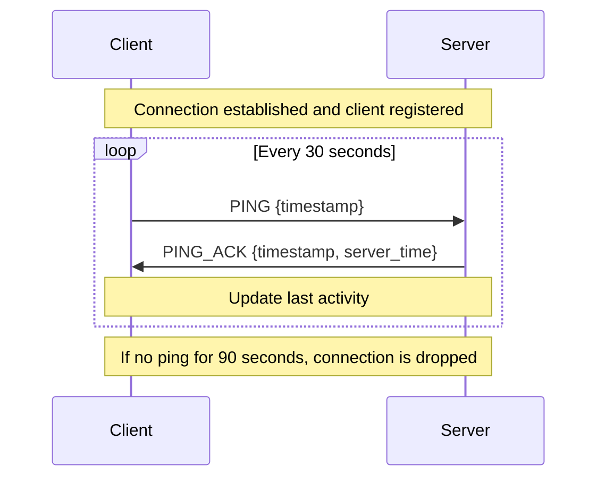

### 5. Error Handling Flow

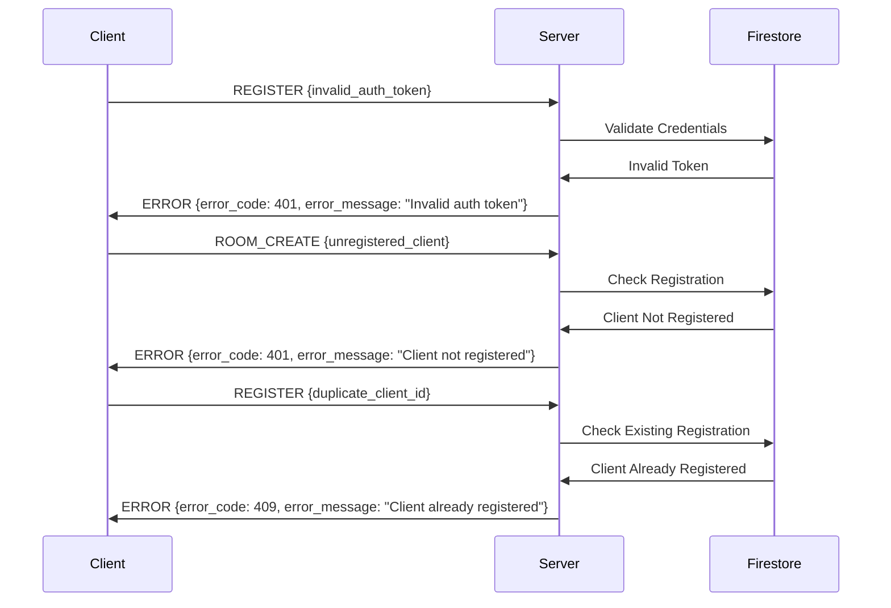

### 6. Complete Client Lifecycle

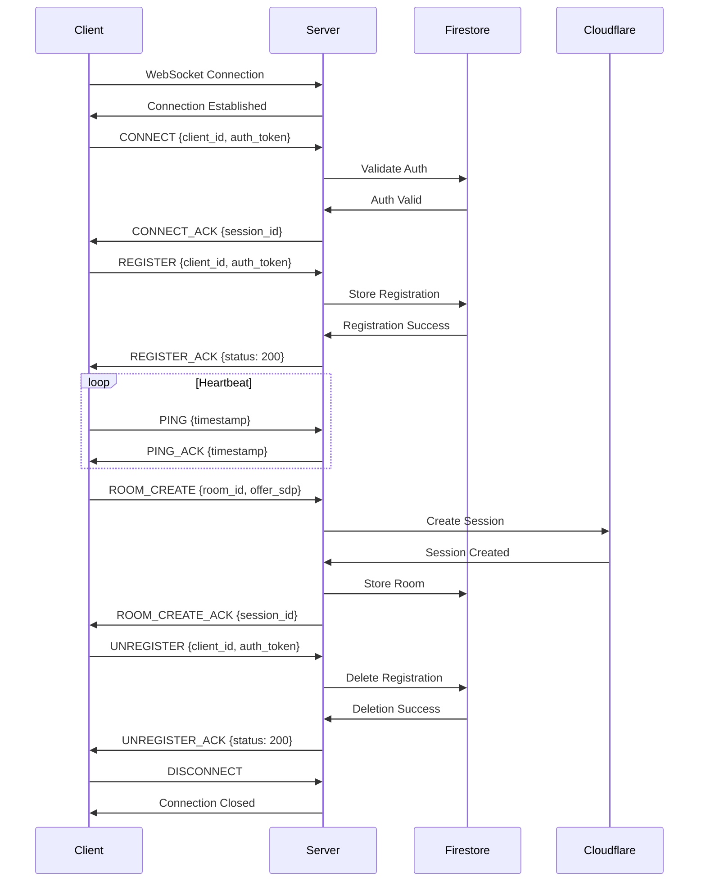

## Timeouts and Configuration

### Connection Timeouts

| Timeout Type | Default Value | Description |
|--------------|---------------|-------------|
| Connection Timeout | 30 seconds | Time to establish WebSocket connection |
| Registration Timeout | 10 seconds | Time to complete registration process |
| Heartbeat Interval | 30 seconds | Interval between ping messages |
| Heartbeat Timeout | 90 seconds | Time before marking connection as dead |
| WebRTC Session Timeout | 300 seconds | Time before terminating inactive WebRTC sessions |
| Database Operation Timeout | 5 seconds | Time for database operations |

### Retry Configuration

| Retry Type | Attempts | Interval | Description |
|------------|----------|----------|-------------|
| Connection Retry | 5 | Exponential backoff | WebSocket connection attempts |
| Registration Retry | 3 | 1 second | Registration attempts |
| Database Retry | 3 | 100ms | Database operation retries |
| Cloudflare Retry | 3 | 1 second | Cloudflare API retries |

### Configuration Example

```toml
[server]
host = "127.0.0.1"
port = 8080
max_connections = 1000
connection_timeout = 30
registration_timeout = 10

[heartbeat]
interval = 30
timeout = 90

[webrtc]
session_timeout = 300
cloudflare_timeout = 10

[database]
operation_timeout = 5
retry_attempts = 3
retry_interval = 100
```

## Examples

### 1. Basic Connection and Registration

```javascript
// JavaScript WebSocket client example
const ws = new WebSocket('ws://127.0.0.1:8080/');

ws.onopen = function() {
    // Send CONNECT message
    const connectMessage = {
        message_type: 0x01, // CONNECT
        uuid: "550e8400-e29b-41d4-a716-446655440000",
        payload_type: 0x02, // JSON
        payload: {
            client_id: "test_client_1",
            auth_token: "test_token_1",
            version: "1.0.0",
            capabilities: ["websocket", "heartbeat", "webrtc"],
            metadata: {
                userAgent: navigator.userAgent,
                timestamp: Date.now()
            }
        }
    };
    
    // Convert to binary and send
    const binaryData = messageToBinary(connectMessage);
    ws.send(binaryData);
};

ws.onmessage = function(event) {
    const message = parseBinaryMessage(event.data);
    
    if (message.message_type === 0x02) { // CONNECT_ACK
        console.log('Connected successfully');
        
        // Send registration
        const registerMessage = {
            message_type: 0x20, // REGISTER
            uuid: "550e8400-e29b-41d4-a716-446655440001",
            payload_type: 0x02, // JSON
            payload: {
                version: "1.0.0",
                client_id: "test_client_1",
                auth_token: "test_token_1",
                capabilities: ["websocket", "heartbeat", "webrtc"],
                metadata: {
                    userAgent: navigator.userAgent,
                    timestamp: Date.now()
                }
            }
        };
        
        const registerBinary = messageToBinary(registerMessage);
        ws.send(registerBinary);
    }
};
```

### 2. WebRTC Room Creation

```javascript
// Create WebRTC room
const createRoom = async (offerSdp) => {
    const roomMessage = {
        message_type: 0x30, // ROOM_CREATE
        uuid: "550e8400-e29b-41d4-a716-446655440002",
        payload_type: 0x02, // JSON
        payload: {
            version: "1.0.0",
            client_id: "test_client_1",
            auth_token: "test_token_1",
            room_id: "meeting-room-123",
            offer_sdp: offerSdp,
            capabilities: ["video", "audio"],
            metadata: {
                room_name: "Team Meeting",
                max_participants: 10,
                recording_enabled: false
            }
        }
    };
    
    const binaryData = messageToBinary(roomMessage);
    ws.send(binaryData);
};
```

### 3. Heartbeat Implementation

```javascript
// Send heartbeat every 30 seconds
let heartbeatInterval;

const startHeartbeat = () => {
    heartbeatInterval = setInterval(() => {
        const heartbeatMessage = {
            message_type: 0x04, // PING
            uuid: "550e8400-e29b-41d4-a716-446655440003",
            payload_type: 0x02, // JSON
            payload: {
                timestamp: Date.now()
            }
        };
        
        const binaryData = messageToBinary(heartbeatMessage);
        ws.send(binaryData);
    }, 30000); // 30 seconds
};

const stopHeartbeat = () => {
    if (heartbeatInterval) {
        clearInterval(heartbeatInterval);
        heartbeatInterval = null;
    }
};
```

### 4. Client Unregistration

```javascript
// Unregister before disconnecting
const unregister = () => {
    const unregisterMessage = {
        message_type: 0x22, // UNREGISTER
        uuid: "550e8400-e29b-41d4-a716-446655440004",
        payload_type: 0x02, // JSON
        payload: {
            version: "1.0.0",
            client_id: "test_client_1",
            auth_token: "test_token_1"
        }
    };
    
    const binaryData = messageToBinary(unregisterMessage);
    ws.send(binaryData);
    
    // Wait for acknowledgment before closing
    setTimeout(() => {
        ws.close(1000, 'Client disconnect');
    }, 100);
};
```

## Configuration

The service can be configured using TOML files or environment variables.

### Configuration File (app-config.toml)

```toml
[server]
host = "127.0.0.1"
port = 8080
max_connections = 1000
connection_timeout = 30
registration_timeout = 10
tls_enabled = false

[auth]
token_secret = "your-secret-key-change-in-production"
token_expiry = 3600
auth_method = "token"
api_keys = [
    "test_client_1:test_token_1",
    "test_client_2:test_token_2"
]

[heartbeat]
interval = 30
timeout = 90

[webrtc]
session_timeout = 300
cloudflare_timeout = 10

[database]
operation_timeout = 5
retry_attempts = 3
retry_interval = 100

[logging]
level = "info"
format = "json"
console_output = true

[metrics]
enabled = true
port = 9090
host = "127.0.0.1"
```

### Environment Variables

```bash
export SIGNAL_MANAGER_SERVER_HOST="0.0.0.0"
export SIGNAL_MANAGER_SERVER_PORT="8080"
export SIGNAL_MANAGER_AUTH_TOKEN_SECRET="your-secret"
export SIGNAL_MANAGER_LOGGING_LEVEL="info"
export SIGNAL_MANAGER_HEARTBEAT_INTERVAL="30"
export SIGNAL_MANAGER_HEARTBEAT_TIMEOUT="90"
```

## Performance Considerations

### Connection Limits

- **Default Max Connections**: 1,000
- **Message Buffer Size**: 8,192 bytes
- **Max Message Size**: 1,048,576 bytes (1MB)
- **Concurrent Registrations**: 500
- **Active WebRTC Sessions**: 200

### Monitoring

The service provides metrics for monitoring:

- **Connection Count**: Number of active connections
- **Registration Count**: Number of registered clients
- **Message Rate**: Messages per second
- **Error Rate**: Error messages per second
- **Session Duration**: Average session length
- **WebRTC Session Count**: Active WebRTC sessions
- **Database Operation Latency**: Average database response time

## Security

### TLS Support

The service supports TLS encryption for secure communication:

```toml
[server]
tls_enabled = true
tls_cert_path = "/path/to/certificate.pem"
tls_key_path = "/path/to/private_key.pem"
```

### Authentication Best Practices

1. **Use Strong Tokens**: Generate cryptographically secure tokens
2. **Token Expiration**: Set reasonable token expiration times
3. **TLS in Production**: Always use TLS in production environments
4. **Rate Limiting**: Implement rate limiting for connection attempts
5. **Input Validation**: Validate all client inputs
6. **Database Security**: Use secure database connections

## Troubleshooting

### Common Issues

1. **Connection Refused**: Check if server is running and port is accessible
2. **Authentication Failed**: Verify client credentials
3. **Registration Failed**: Check if client is already registered
4. **WebRTC Session Creation Failed**: Verify Cloudflare credentials
5. **Database Connection Failed**: Check Firestore configuration
6. **Connection Drops**: Check heartbeat configuration

### Debug Mode

Enable debug logging for troubleshooting:

```toml
[logging]
level = "debug"
```

### Health Check Endpoint

The service provides a health check endpoint:

```bash
curl http://127.0.0.1:8080/health
```

Response:
```json
{
  "status": "healthy",
  "timestamp": "2024-01-01T12:00:00Z",
  "active_connections": 5,
  "registered_clients": 3,
  "webrtc_sessions": 2
}
```

## Conclusion

The Signal Manager Service provides a robust, high-performance solution for real-time communication between clients. Its binary protocol ensures efficient message exchange, while its modular architecture allows for easy extension and customization.

The service supports comprehensive client registration, WebRTC room management, and secure authentication, making it suitable for modern real-time applications.

For more information, refer to the source code and test examples in the project repository. 