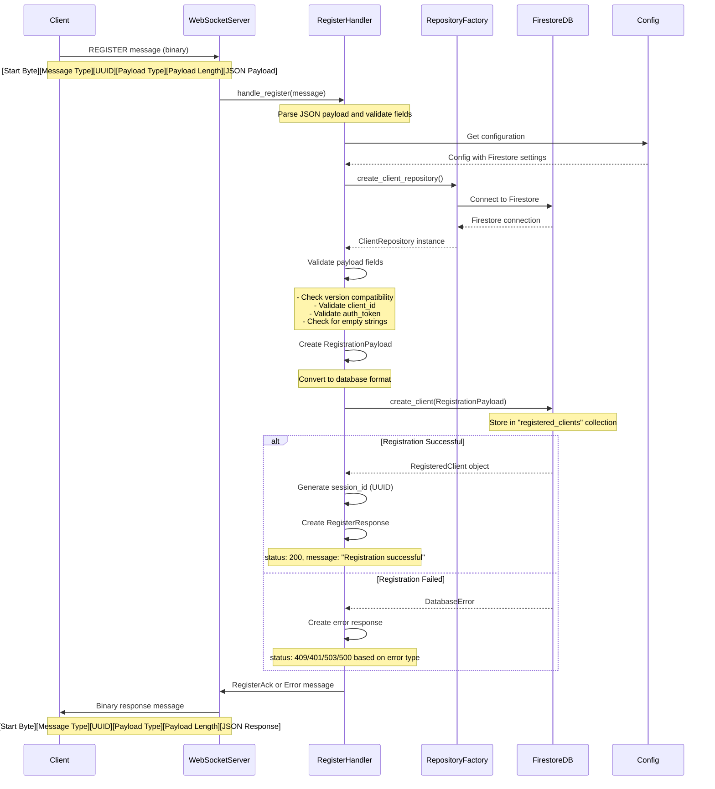
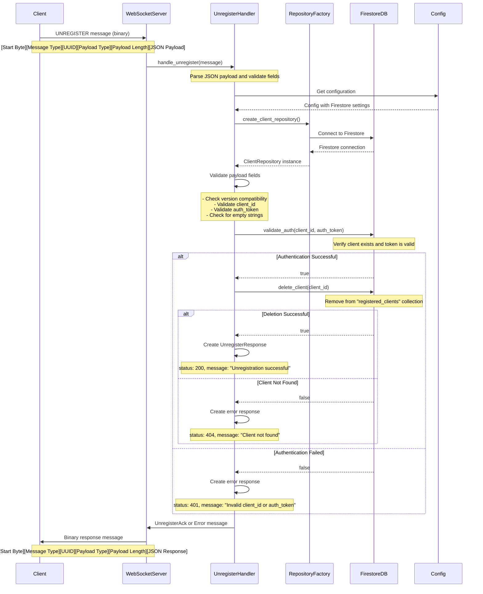

# Signal Manager Service

A high-performance WebSocket server for managing signaling between agents and backend services, implemented in Rust with comprehensive WebRTC room management and Cloudflare integration.

## Features

- **Binary WebSocket Protocol**: Custom binary message format for efficient communication
- **Authentication**: Secure client authentication with token-based validation
- **Session Management**: Robust session tracking and management
- **Message Routing**: Efficient message routing between connected clients
- **Heartbeat Support**: Keep-alive mechanism for connection health monitoring
- **WebRTC Room Management**: Complete room creation, joining, and leaving with Cloudflare integration
- **Firestore Integration**: Persistent storage for rooms, clients, and session state
- **High Performance**: Built with Tokio async runtime for high concurrency
- **Observability**: Comprehensive logging and metrics
- **Security**: Rate limiting, input validation, and secure error handling

## Architecture Overview

### Core Components

- **WebSocket Server**: Binary protocol server with authentication and session management
- **WebRTC Handlers**: Room creation, joining, and leaving with Cloudflare integration
- **Database Layer**: Repository pattern with Firestore and in-memory implementations
- **Cloudflare Integration**: Real-time WebRTC session and track management
- **Type 2 Handlers**: Registration and unregistration functionality
- **Frame Handlers**: Message processing and routing

### Message Protocol

The service implements a custom binary WebSocket protocol with the following message structure:

```
[Start Byte (1 byte)] [Message Type (1 byte)] [Message UUID (16 bytes)] [Payload Type (1 byte)] [Payload Length (2 bytes)] [Payload (N bytes)]
```

#### Message Types

**Connection Management:**
- `CONNECT (0x01)`: Client connection request
- `CONNECT_ACK (0x02)`: Connection acknowledgment
- `DISCONNECT (0x03)`: Client disconnection notification
- `HEARTBEAT (0x04)`: Keep-alive heartbeat
- `HEARTBEAT_ACK (0x05)`: Heartbeat acknowledgment

**Signaling:**
- `SIGNAL_OFFER (0x10)`: WebRTC offer signal
- `SIGNAL_ANSWER (0x11)`: WebRTC answer signal
- `SIGNAL_ICE_CANDIDATE (0x12)`: ICE candidate signal

**Registration:**
- `REGISTER (0x20)`: Client registration
- `REGISTER_ACK (0x21)`: Registration acknowledgment
- `UNREGISTER (0x22)`: Client unregistration
- `UNREGISTER_ACK (0x23)`: Unregistration acknowledgment

**WebRTC Room Management:**
- `WEBRTC_ROOM_CREATE (0x30)`: Create a new WebRTC room
- `WEBRTC_ROOM_CREATE_ACK (0x31)`: Room creation acknowledgment
- `WEBRTC_ROOM_JOIN (0x32)`: Join an existing WebRTC room
- `WEBRTC_ROOM_JOIN_ACK (0x33)`: Room join acknowledgment
- `WEBRTC_ROOM_LEAVE (0x34)`: Leave a WebRTC room
- `WEBRTC_ROOM_LEAVE_ACK (0x35)`: Room leave acknowledgment

**Error Handling:**
- `ERROR (0xFF)`: Error message

#### Payload Types

- `BINARY (0x01)`: Raw binary data
- `JSON (0x02)`: JSON-encoded data
- `TEXT (0x03)`: Plain text data
- `PROTOBUF (0x04)`: Protocol Buffer encoded data
- `CBOR (0x05)`: CBOR encoded data

### Message Examples

#### Heartbeat/Ping Message

**JSON Payload:**
```json
{
  "timestamp": 1704067200000
}
```

**Binary Frame Structure:**
```
[Start Byte (0xAA)] [Message Type (0x04)] [UUID (16 bytes)] [Payload Type (0x02)] [Payload Length (2 bytes)] [JSON Payload (N bytes)]
```

**Example Binary Frame (hex):**
```
AA 04 550E8400E29B41D4A716446655440002 02 0018 7B2274696D657374616D70223A313730343036373230303030307D
```

**Frame Breakdown:**
- Start Byte: `AA` (0xAA)
- Message Type: `04` (HEARTBEAT = 0x04)
- UUID: `550E8400E29B41D4A716446655440002` (16 bytes)
- Payload Type: `02` (JSON = 0x02)
- Payload Length: `0018` (24 bytes, big-endian)
- JSON Payload: Base64-encoded JSON string

**Heartbeat Response (Ack):**
```json
{
  "timestamp": 1704067200000
}
```

**Binary Frame Structure (Response):**
```
[Start Byte (0xAA)] [Message Type (0x05)] [UUID (16 bytes)] [Payload Type (0x02)] [Payload Length (2 bytes)] [JSON Payload (N bytes)]
```

**Example Response Frame (hex):**
```
AA 05 550E8400E29B41D4A716446655440003 02 0018 7B2274696D657374616D70223A313730343036373230303030307D
```

### Client Registration Process

The service implements a comprehensive client registration system that allows clients to register with the signaling service and establish their identity for WebRTC operations.

#### Registration Flow

The registration process involves several components working together:

1. **Client**: Sends registration request with credentials and capabilities
2. **WebSocket Server**: Receives and validates the binary message
3. **Register Handler**: Processes the registration logic
4. **Repository Factory**: Creates appropriate database repository
5. **Firestore Database**: Stores client registration data
6. **Response**: Returns registration acknowledgment with session ID

#### Registration Sequence Diagram



#### Registration Components

**Register Handler (`src/type_two_handlers/register.rs`)**
- Processes `REGISTER` and `UNREGISTER` message types
- Validates payload structure and required fields
- Handles version compatibility checking
- Creates database registration payload
- Generates unique session IDs
- Returns appropriate acknowledgment or error responses

**Repository Factory (`src/database/repository_factory.rs`)**
- Creates appropriate repository instances based on configuration
- Supports both Firestore and in-memory implementations
- Provides abstraction layer for database operations

**Client Repository (`src/database/client_repository.rs`)**
- Defines trait interface for client database operations
- Supports create, read, update, delete operations
- Handles authentication validation
- Manages client session tracking

**Firestore Implementation (`src/database/firestore_webrtc_client_repository.rs`)**
- Implements client repository for Firestore database
- Stores client data in `registered_clients` collection
- Handles connection management and error handling
- Provides real-time data persistence

#### Registration Payload Structure

**JSON Payload:**
```json
{
  "version": "1.0.0",
  "client_id": "unique_client_identifier",
  "auth_token": "authentication_token",
  "room_id": "optional_room_association",
  "capabilities": ["websocket", "heartbeat", "webrtc"],
  "metadata": {
    "platform": "web",
    "version": "1.0.0",
    "user_agent": "Mozilla/5.0..."
  }
}
```

**Binary Frame Structure:**
```
[Start Byte (0xAA)] [Message Type (0x20)] [UUID (16 bytes)] [Payload Type (0x02)] [Payload Length (2 bytes)] [JSON Payload (N bytes)]
```

**Example Binary Frame (hex):**
```
AA 20 550E8400E29B41D4A716446655440000 02 00C8 7B2276657273696F6E223A22312E302E30222C22636C69656E745F6964223A22756E697175655F636C69656E745F6964656E746966696572222C22617574685F746F6B656E223A2261757468656E7469636174696F6E5F746F6B656E222C226361706162696C6974696573223A5B22776562736F636B6574222C22686561727462656174222C22776562727463225D2C226D65746164617461223A7B22706C6174666F726D223A22776562222C2276657273696F6E223A22312E302E30227D7D
```

**Frame Breakdown:**
- Start Byte: `AA` (0xAA)
- Message Type: `20` (REGISTER = 0x20)
- UUID: `550E8400E29B41D4A716446655440000` (16 bytes)
- Payload Type: `02` (JSON = 0x02)
- Payload Length: `00C8` (200 bytes, big-endian)
- JSON Payload: Base64-encoded JSON string

#### Registration Response Structure

**Success Response:**
```json
{
  "version": "1.0.0",
  "status": 200,
  "message": "Registration successful",
  "client_id": "unique_client_identifier",
  "session_id": "generated_session_uuid"
}
```

**Error Response:**
```json
{
  "version": "1.0.0",
  "status": 400,
  "message": "Missing or invalid 'client_id' field",
  "client_id": null,
  "session_id": null
}
```

#### Registration Error Handling

The registration process handles various error conditions:

- **400 Bad Request**: Invalid payload structure, missing required fields
- **401 Unauthorized**: Invalid authentication token
- **409 Conflict**: Client ID already exists
- **503 Service Unavailable**: Database connection issues
- **500 Internal Server Error**: Unexpected server errors

#### Unregistration Process

The unregistration process follows a similar flow but removes the client from the system:

1. **Client Request**: Sends `UNREGISTER` message with client credentials
2. **Validation**: Service validates client exists and has permission
3. **Database Cleanup**: Removes client from Firestore
4. **Session Cleanup**: Terminates associated sessions
5. **Response**: Returns unregistration acknowledgment

#### Unregistration Sequence Diagram



#### Unregistration Components

**Unregister Handler (`src/type_two_handlers/register.rs`)**
- Processes `UNREGISTER` message type
- Validates payload structure and required fields
- Handles version compatibility checking
- Performs authentication validation before deletion
- Manages client removal from database
- Returns appropriate acknowledgment or error responses

**Authentication Validation**
- Validates client exists in database
- Verifies authentication token matches stored token
- Prevents unauthorized client deletion
- Ensures only registered clients can unregister

**Database Cleanup**
- Removes client record from `registered_clients` collection
- Handles cascading cleanup of related data
- Manages session termination
- Updates room associations if applicable

#### Unregistration Payload Structure

**JSON Payload:**
```json
{
  "version": "1.0.0",
  "client_id": "unique_client_identifier",
  "auth_token": "authentication_token"
}
```

**Binary Frame Structure:**
```
[Start Byte (0xAA)] [Message Type (0x22)] [UUID (16 bytes)] [Payload Type (0x02)] [Payload Length (2 bytes)] [JSON Payload (N bytes)]
```

**Example Binary Frame (hex):**
```
AA 22 550E8400E29B41D4A716446655440001 02 0048 7B2276657273696F6E223A22312E302E30222C22636C69656E745F6964223A22756E697175655F636C69656E745F6964656E746966696572222C22617574685F746F6B656E223A2261757468656E7469636174696F6E5F746F6B656E227D
```

**Frame Breakdown:**
- Start Byte: `AA` (0xAA)
- Message Type: `22` (UNREGISTER = 0x22)
- UUID: `550E8400E29B41D4A716446655440001` (16 bytes)
- Payload Type: `02` (JSON = 0x02)
- Payload Length: `0048` (72 bytes, big-endian)
- JSON Payload: Base64-encoded JSON string

#### Unregistration Response Structure

**Success Response:**
```json
{
  "version": "1.0.0",
  "status": 200,
  "message": "Unregistration successful",
  "client_id": "unique_client_identifier"
}
```

**Error Responses:**

**Client Not Found (404):**
```json
{
  "version": "1.0.0",
  "status": 404,
  "message": "Client not found",
  "client_id": null
}
```

**Authentication Failed (401):**
```json
{
  "version": "1.0.0",
  "status": 401,
  "message": "Invalid client_id or auth_token",
  "client_id": null
}
```

**Bad Request (400):**
```json
{
  "version": "1.0.0",
  "status": 400,
  "message": "Missing or invalid 'client_id' field",
  "client_id": null
}
```

#### Unregistration Error Handling

The unregistration process handles various error conditions:

- **400 Bad Request**: Invalid payload structure, missing required fields
- **401 Unauthorized**: Invalid authentication token or client_id
- **404 Not Found**: Client does not exist in database
- **500 Internal Server Error**: Database connection issues or unexpected errors

#### Unregistration Security Features

- **Authentication Required**: All unregistration requests require valid auth_token
- **Client Validation**: Verifies client exists before attempting deletion
- **Token Verification**: Ensures auth_token matches stored client token
- **Audit Trail**: Logs all unregistration attempts and results
- **Session Cleanup**: Terminates associated sessions and connections

### WebRTC Room Management

The service provides comprehensive WebRTC room management with Cloudflare integration, enabling real-time audio/video communication between clients.

#### Room Concept

A **WebRTC Room** is a virtual meeting space where clients can establish peer-to-peer connections for real-time communication. Each room has:

- **Unique Room ID**: Generated automatically when room is created
- **Cloudflare Session**: Backend session for signaling and connection management
- **Client Roles**: Sender (initiator) and Receiver (participant) roles
- **Session State**: Active, inactive, or terminated status
- **Metadata**: Room configuration and connection information

#### Room Lifecycle

**1. Room Creation**
- **Trigger**: First client (sender) requests room creation
- **Process**: 
  - Generate unique room ID
  - Create Cloudflare Realtime session
  - Store room metadata in Firestore
  - Register sender client
- **Result**: Active room with sender connected

**2. Room Participation**
- **Trigger**: Additional clients join existing room
- **Process**:
  - Validate room exists and is active
  - Check client permissions and role availability
  - Add client to room session
  - Update room state in database
- **Result**: Multiple clients in active room

**3. Room Termination**
- **Trigger**: All clients leave or timeout occurs
- **Process**:
  - Remove clients from room
  - Terminate Cloudflare session
  - Mark room as inactive
  - Archive room data for analytics
- **Result**: Room becomes inactive/terminated

#### Room Creation Flow

**Client Request:**
```json
{
  "version": "1.0.0",
  "client_id": "sender_client_1",
  "auth_token": "valid_token",
  "role": "sender",
  "offer_sdp": "v=0\r\no=- 1234567890 2 IN IP4 127.0.0.1\r\ns=-\r\nt=0 0\r\n...",
  "metadata": {
    "platform": "web",
    "version": "1.0.0"
  }
}
```

**Process Steps:**
1. **Validation**: Check client credentials and role requirements
2. **Room Generation**: Create unique room ID using Cloudflare API
3. **Session Creation**: Initialize Cloudflare Realtime session with offer SDP
4. **Database Storage**: Persist room and client state in Firestore
5. **Response**: Return room_id, session_id, and connection details

**Success Response:**
```json
{
  "version": "1.0.0",
  "status": 200,
  "message": "Room created successfully",
  "room_id": "abc123def456",
  "session_id": "session_xyz789",
  "app_id": "cloudflare_app_id",
  "stun_url": "stun:stun.cloudflare.com:3478",
  "connection_info": {
    "session_id": "session_xyz789",
    "room_id": "abc123def456",
    "app_id": "cloudflare_app_id"
  }
}
```

#### Room Join Flow

**Client Request:**
```json
{
  "version": "1.0.0",
  "client_id": "receiver_client_2",
  "auth_token": "valid_token",
  "room_id": "abc123def456",
  "role": "receiver",
  "offer_sdp": null,
  "metadata": {
    "platform": "mobile",
    "version": "1.0.0"
  }
}
```

**Process Steps:**
1. **Room Validation**: Verify room exists and is active
2. **Client Validation**: Check client credentials and permissions
3. **Role Assignment**: Validate role availability (sender/receiver)
4. **Session Join**: Add client to existing Cloudflare session
5. **Database Update**: Register client in room and update state
6. **Response**: Return session information and connection details

**Success Response:**
```json
{
  "version": "1.0.0",
  "status": 200,
  "message": "Successfully joined room",
  "room_id": "abc123def456",
  "session_id": "session_xyz789",
  "app_id": "cloudflare_app_id",
  "stun_url": "stun:stun.cloudflare.com:3478",
  "connection_info": {
    "session_id": "session_xyz789",
    "room_id": "abc123def456",
    "app_id": "cloudflare_app_id"
  }
}
```

#### Room Leave Flow

**Client Request:**
```json
{
  "version": "1.0.0",
  "client_id": "sender_client_1",
  "auth_token": "valid_token",
  "room_id": "abc123def456",
  "reason": "User initiated disconnect"
}
```

**Process Steps:**
1. **Client Validation**: Verify client is in the specified room
2. **Session Cleanup**: Terminate client's Cloudflare session if active
3. **Database Update**: Remove client from room in Firestore
4. **Room Check**: Determine if room should be terminated
5. **Room Termination**: If empty, terminate entire room session
6. **Response**: Confirm client removal and room status

**Success Response:**
```json
{
  "version": "1.0.0",
  "status": 200,
  "message": "Successfully left room",
  "room_id": "abc123def456",
  "client_id": "sender_client_1"
}
```

#### Room States

**Active Room:**
- Has at least one connected client
- Cloudflare session is active
- Accepts new client connections
- Supports real-time communication

**Inactive Room:**
- No connected clients
- Cloudflare session terminated
- Cannot accept new connections
- Archived for analytics

**Terminated Room:**
- Manually terminated or timed out
- All sessions cleaned up
- Historical data preserved
- Cannot be reactivated

#### Client Roles

**Sender Role:**
- Initiates room creation
- Provides initial SDP offer
- Establishes media stream
- Controls room lifecycle
- Can be only one per room

**Receiver Role:**
- Joins existing room
- Receives media stream
- Responds with SDP answer
- Multiple receivers allowed
- Passive participant

#### Room Security

**Authentication:**
- All room operations require valid auth_token
- Client must be registered before room access
- Role-based permissions enforced

**Validation:**
- Room existence and status checks
- Client membership verification
- Role availability validation
- Session state consistency

**Cleanup:**
- Automatic session termination on client disconnect
- Room termination when empty
- Historical data preservation
- Resource cleanup and monitoring

#### Room Error Handling

**Common Errors:**
- **404 Room Not Found**: Room doesn't exist or is inactive
- **400 Invalid Role**: Role not available or invalid
- **401 Unauthorized**: Invalid client credentials
- **409 Client Already in Room**: Client already connected
- **500 Session Error**: Cloudflare session issues

**Recovery Strategies:**
- Automatic reconnection attempts
- Session state synchronization
- Graceful degradation on errors
- Comprehensive error logging

### Database Structure

The service uses Google Cloud Firestore as its primary database, with a well-structured collection hierarchy designed for efficient querying and data management.

#### Firestore Collections Overview

The database is organized into the following collections:

| Collection | Purpose | Document ID | Primary Use |
|------------|---------|-------------|-------------|
| `webrtc_rooms` | Active WebRTC rooms | `room_id` | Room management and session tracking |
| `webrtc_clients` | WebRTC client registrations | `client_id` | Client state and session management |
| `registered_clients` | General client registrations | `client_id` | Client authentication and capabilities |
| `terminated_rooms` | Historical room data | `room_id` | Audit trail and analytics |
| `room_created` | Room creation events | `room_uuid` | Creation audit trail |
| `client_in_room` | Active client-room associations | `client_id` | Real-time room membership |
| `client_in_terminated_room` | Historical client-room data | `client_id` | Historical analytics |

#### Collection Details

##### `webrtc_rooms` Collection
Stores active WebRTC room information and session state.

**Document Structure:**
```json
{
  "id": "unique_room_uuid",
  "room_id": "abc123",
  "app_id": "cloudflare_app_id",
  "created_at": "2024-06-01T12:00:00Z",
  "status": "Active",
  "sender_client_id": "client_1",
  "receiver_client_id": "client_2",
  "session_id": "session_xyz",
  "metadata": {
    "created_at": "2024-06-01T12:00:00Z",
    "platform": "web",
    "version": "1.0.0"
  },
  "record_created_at": "2024-06-01T12:00:00Z"
}
```

**Fields:**
- `id` (String): Unique room UUID
- `room_id` (String): Human-readable room identifier
- `app_id` (String): Cloudflare application ID
- `created_at` (DateTime): When the room was created
- `status` (Enum): `Active`, `Inactive`, `Terminated`, `Pending`
- `sender_client_id` (String, Optional): ID of sender client
- `receiver_client_id` (String, Optional): ID of receiver client
- `session_id` (String, Optional): Cloudflare session identifier
- `metadata` (JSON): Additional room metadata
- `record_created_at` (DateTime): Database record creation timestamp

##### `webrtc_clients` Collection
Stores WebRTC client registrations and session state.

**Document Structure:**
```json
{
  "id": "unique_client_uuid",
  "client_id": "client_1",
  "room_id": "abc123",
  "role": "sender",
  "session_id": "session_xyz",
  "joined_at": "2024-06-01T12:00:00Z",
  "status": "Active",
  "metadata": {
    "platform": "web",
    "version": "1.0.0",
    "user_agent": "Mozilla/5.0..."
  },
  "record_created_at": "2024-06-01T12:00:00Z"
}
```

**Fields:**
- `id` (String): Unique client UUID
- `client_id` (String): Human-readable client identifier
- `room_id` (String): Associated room identifier
- `role` (Enum): `Sender` or `Receiver`
- `session_id` (String, Optional): Cloudflare session identifier
- `joined_at` (DateTime): When client joined the room
- `status` (Enum): `Active`, `Inactive`, `Disconnected`, `Pending`
- `metadata` (JSON): Additional client metadata
- `record_created_at` (DateTime): Database record creation timestamp

##### `registered_clients` Collection
Stores general client registration data for authentication and capabilities.

**Document Structure:**
```json
{
  "id": "unique_client_uuid",
  "client_id": "client_1",
  "auth_token": "hashed_auth_token",
  "room_id": "abc123",
  "capabilities": ["websocket", "heartbeat", "webrtc"],
  "registered_at": "2024-06-01T12:00:00Z",
  "last_seen": "2024-06-01T12:30:00Z",
  "status": "Active",
  "metadata": {
    "platform": "web",
    "version": "1.0.0",
    "user_agent": "Mozilla/5.0..."
  },
  "record_created_at": "2024-06-01T12:00:00Z"
}
```

**Fields:**
- `id` (String): Unique client UUID
- `client_id` (String): Human-readable client identifier
- `auth_token` (String): Hashed authentication token
- `room_id` (String, Optional): Associated room identifier
- `capabilities` (Array): List of client capabilities
- `registered_at` (DateTime): When client was registered
- `last_seen` (DateTime, Optional): Last activity timestamp
- `status` (Enum): `Active`, `Inactive`, `Suspended`, `Pending`
- `metadata` (JSON): Additional client metadata
- `record_created_at` (DateTime): Database record creation timestamp

##### `terminated_rooms` Collection
Stores historical data about terminated rooms for audit and analytics.

**Document Structure:**
```json
{
  "id": "unique_termination_uuid",
  "room_id": "abc123",
  "terminated_at": "2024-06-01T13:00:00Z",
  "termination_recorded_at": "2024-06-01T13:00:05Z",
  "room_data": {
    "session_duration": 3600,
    "participant_count": 2,
    "final_status": "completed"
  },
  "termination_reason": "User initiated",
  "terminated_by": "client_1",
  "metadata": {
    "platform": "web",
    "version": "1.0.0"
  },
  "record_created_at": "2024-06-01T13:00:05Z"
}
```

**Fields:**
- `id` (String): Unique termination record UUID
- `room_id` (String): Identifier of terminated room
- `terminated_at` (DateTime): When room was terminated
- `termination_recorded_at` (DateTime): When termination was recorded
- `room_data` (JSON): Room state at termination
- `termination_reason` (String, Optional): Reason for termination
- `terminated_by` (String, Optional): Client that initiated termination
- `metadata` (JSON): Additional termination metadata
- `record_created_at` (DateTime): Database record creation timestamp

##### `room_created` Collection
Stores audit trail of room creation events.

**Document Structure:**
```json
{
  "id": "unique_creation_uuid",
  "room_uuid": "550e8400-e29b-41d4-a716-446655440000",
  "created_at": "2024-06-01T12:00:00Z",
  "room_data": {
    "app_id": "cloudflare_app_id",
    "initial_participants": 1,
    "creation_type": "manual"
  },
  "created_by": "client_1",
  "metadata": {
    "platform": "web",
    "version": "1.0.0"
  },
  "record_created_at": "2024-06-01T12:00:00Z"
}
```

**Fields:**
- `id` (String): Unique creation record UUID
- `room_uuid` (String): UUID of created room
- `created_at` (DateTime): When room was created
- `room_data` (JSON): Room configuration at creation
- `created_by` (String, Optional): Client that created the room
- `metadata` (JSON): Additional creation metadata
- `record_created_at` (DateTime): Database record creation timestamp

##### `client_in_room` Collection
Stores active client-room associations for real-time tracking.

**Document Structure:**
```json
{
  "id": "unique_association_uuid",
  "client_id": "client_1",
  "room_id": "abc123",
  "joined_at": "2024-06-01T12:00:00Z",
  "last_activity": "2024-06-01T12:30:00Z",
  "status": "Active",
  "capabilities": ["websocket", "heartbeat", "webrtc"],
  "metadata": {
    "platform": "web",
    "version": "1.0.0"
  },
  "record_created_at": "2024-06-01T12:00:00Z"
}
```

**Fields:**
- `id` (String): Unique association UUID
- `client_id` (String): Client identifier
- `room_id` (String): Room identifier
- `joined_at` (DateTime): When client joined the room
- `last_activity` (DateTime): Last activity timestamp
- `status` (Enum): `Active`, `Inactive`, `Away`, `Busy`
- `capabilities` (Array): Client capabilities
- `metadata` (JSON): Additional association metadata
- `record_created_at` (DateTime): Database record creation timestamp

##### `client_in_terminated_room` Collection
Stores historical client-room associations for analytics.

**Document Structure:**
```json
{
  "id": "unique_historical_uuid",
  "client_id": "client_1",
  "room_id": "abc123",
  "joined_at": "2024-06-01T12:00:00Z",
  "left_at": "2024-06-01T13:00:00Z",
  "termination_reason": "Room terminated",
  "terminated_by": "client_1",
  "final_status": "Disconnected",
  "capabilities": ["websocket", "heartbeat", "webrtc"],
  "metadata": {
    "platform": "web",
    "version": "1.0.0"
  },
  "record_created_at": "2024-06-01T13:00:05Z"
}
```

**Fields:**
- `id` (String): Unique historical record UUID
- `client_id` (String): Client identifier
- `room_id` (String): Terminated room identifier
- `joined_at` (DateTime): When client joined the room
- `left_at` (DateTime): When client left the room
- `termination_reason` (String): Reason for room termination
- `terminated_by` (String): Client that initiated termination
- `final_status` (Enum): `Disconnected`, `VoluntaryDisconnect`, `Kicked`, `Banned`
- `capabilities` (Array): Client capabilities at termination
- `metadata` (JSON): Additional historical metadata
- `record_created_at` (DateTime): Database record creation timestamp

#### Database Relationships

**Primary Relationships:**
- `webrtc_rooms` ↔ `webrtc_clients`: One-to-many (room can have multiple clients)
- `registered_clients` ↔ `client_in_room`: One-to-one (registered client can be in one room)
- `webrtc_rooms` ↔ `terminated_rooms`: One-to-one (active room becomes terminated room)
- `client_in_room` ↔ `client_in_terminated_room`: One-to-one (active association becomes historical)

**Query Patterns:**
- Find active clients in a room: Query `webrtc_clients` by `room_id` and `status = "Active"`
- Find room by session: Query `webrtc_rooms` by `session_id`
- Find client sessions: Query `webrtc_clients` by `client_id`
- Audit trail: Query `terminated_rooms` and `client_in_terminated_room` by date ranges

#### Database Indexes

**Recommended Firestore Indexes:**
- `webrtc_clients`: `room_id` + `status`
- `webrtc_clients`: `client_id` + `status`
- `webrtc_rooms`: `session_id`
- `webrtc_rooms`: `status` + `created_at`
- `terminated_rooms`: `terminated_at` (for date range queries)
- `client_in_terminated_room`: `left_at` (for date range queries)
- `room_created`: `created_at` (for date range queries)

### Cloudflare Integration

The service integrates with Cloudflare Realtime API for WebRTC session management:

- **Session Creation**: Creates Cloudflare sessions for WebRTC rooms
- **Track Management**: Adds and manages audio/video tracks
- **SDP Exchange**: Handles offer/answer SDP negotiation
- **Session Termination**: Properly cleans up Cloudflare sessions

### Configuration

The service uses a comprehensive TOML configuration:

```toml
[server]
host = "127.0.0.1"
port = 8080
max_connections = 1000
heartbeat_interval = 30
tls_enabled = false
read_buffer_size = 8192
write_buffer_size = 8192
max_message_size = 1048576

[firestore]
project_id = "your-project-id"
credentials_path = "/path/to/credentials.json"
database_name = "signal-manager-service-db"
auth_method = "service_account"
region = "us-central1"

[auth]
token_secret = "your-secret-key-change-in-production"
token_expiry = 3600
auth_method = "token"
api_keys = ["test_client_1:test_token_1", "test_client_2:test_token_2"]

[cloudflare]
app_id = "your-cloudflare-app-id"
app_secret = "your-cloudflare-app-secret"
base_url = "https://rtc.live.cloudflare.com/v1"
stun_url = "stun:stun.cloudflare.com:3478"

[logging]
level = "info"
format = "json"
console_output = true
max_file_size = 10485760
max_files = 5

[metrics]
enabled = true
port = 9090
host = "127.0.0.1"
connection_stats_interval = 60
message_stats_interval = 30

[session]
session_timeout = 3600
cleanup_interval = 300
max_sessions_per_client = 1

[security]
rate_limit_enabled = true
max_messages_per_minute = 100
max_connections_per_ip = 10
allowed_origins = ["*"]
```

## Quick Start

### Prerequisites

- Rust 1.88.0 or later
- Cargo (included with Rust)
- Google Cloud Platform account (for Firestore)
- Cloudflare account with Realtime API access

### Installation

1. Clone the repository and navigate to the service directory:
```bash
cd signal_manager_service
```

2. Configure the service:
   - Copy `config.toml` and update with your credentials
   - Set up Firestore credentials
   - Configure Cloudflare Realtime API credentials

3. Build the service:
```bash
cargo build --release
```

4. Run the service:
```bash
cargo run --release
```

The service will start listening on `127.0.0.1:8080` by default.

### Environment Variables

You can also configure the service using environment variables with the `SIGNAL_MANAGER_` prefix:

```bash
export SIGNAL_MANAGER_SERVER_HOST="0.0.0.0"
export SIGNAL_MANAGER_SERVER_PORT="8080"
export SIGNAL_MANAGER_AUTH_TOKEN_SECRET="your-secret"
export SIGNAL_MANAGER_CLOUDFLARE_APP_ID="your-app-id"
export SIGNAL_MANAGER_CLOUDFLARE_APP_SECRET="your-app-secret"
```

## Usage Examples

### Connecting to the Service

```rust
// Connect message (JSON payload)
let connect_message = Message::new(
    MessageType::Connect,
    Payload::Connect(ConnectPayload {
        client_id: "client_1".to_string(),
        auth_token: "valid_token".to_string(),
    })
);
```

### Creating a WebRTC Room

```rust
let room_create_message = Message::new(
    MessageType::WebRTCRoomCreate,
    Payload::WebRTCRoomCreate(WebRTCRoomCreatePayload {
        version: "1.0.0".to_string(),
        client_id: "client_1".to_string(),
        auth_token: "valid_token".to_string(),
        role: "sender".to_string(),
        offer_sdp: Some("v=0\r\no=- 1234567890 2 IN IP4 127.0.0.1\r\ns=-\r\nt=0 0\r\n...".to_string()),
        metadata: None,
    })
);
```

### Joining a WebRTC Room

```rust
let room_join_message = Message::new(
    MessageType::WebRTCRoomJoin,
    Payload::WebRTCRoomJoin(WebRTCRoomJoinPayload {
        version: "1.0.0".to_string(),
        client_id: "client_2".to_string(),
        auth_token: "valid_token".to_string(),
        room_id: "abc123".to_string(),
        role: "receiver".to_string(),
        offer_sdp: None,
        metadata: None,
    })
);
```

### Authentication

The service supports token-based authentication. Valid tokens for testing:

- Client ID: `test_client_1`, Token: `test_token_1`
- Client ID: `test_client_2`, Token: `test_token_2`

## Development

### Building

```bash
# Debug build
cargo build

# Release build
cargo build --release
```

### Testing

The project includes comprehensive unit and integration tests for all major components, including Cloudflare and Firestore integrations. You can run tests in various combinations depending on your needs:

#### Run All Tests
```bash
cargo test
```

#### Run All Tests With Output
```bash
cargo test -- --nocapture
```

#### Run Only Unit Tests (exclude integration tests)
```bash
cargo test --lib
```

#### Run Only Integration Tests
```bash
cargo test --test integration_tests
```

#### Run Firestore Integration Tests
```bash
cargo test --test firestore_integration_tests
```

#### Run Cloudflare Unit Tests (mocked)
```bash
cargo test --test cloudflare_client_unit
cargo test --test cloudflare_session_unit
```

#### Run Real Cloudflare API Integration Tests
These tests use your real Cloudflare credentials from `config.toml` and will be skipped if credentials are invalid. They verify live connectivity and API actions (session creation, track management, etc):
```bash
cargo test --test cloudflare_integration_test -- --nocapture
```

- If your credentials are invalid, these tests will print `Skipping test: Cloudflare credentials are invalid` and not fail the suite.
- If your credentials are valid, these tests will create, modify, and terminate real sessions using the Cloudflare Realtime API.

#### Run a Specific Test by Name
```bash
cargo test test_cloudflare_create_session_real_api -- --nocapture
```

#### Run Tests in a Submodule or Directory
```bash
cargo test --test database/integration
```

#### Additional Test Options
- Run ignored/expensive tests: `cargo test -- --ignored`
- Filter by test name: `cargo test some_test_name`
- Run with backtrace on failure: `RUST_BACKTRACE=1 cargo test`

#### Notes
- Real API tests may use your Cloudflare quota and create/modify live data.
- Make sure your `config.toml` is set up with valid credentials for Cloudflare and Firestore to run all integration tests.
- All repository traits have in-memory mock implementations for fast, isolated unit tests.

### Code Quality

```bash
# Format code
cargo fmt

# Run clippy lints
cargo clippy
```

## Architecture

The service is built with a modular architecture:

- **`main.rs`**: Application entry point and CLI handling
- **`lib.rs`**: Module definitions and exports
- **`config.rs`**: Configuration management
- **`error.rs`**: Custom error types
- **`message.rs`**: Binary protocol implementation with WebRTC payloads
- **`server.rs`**: WebSocket server implementation
- **`session.rs`**: Session management
- **`auth.rs`**: Authentication handling
- **`database/`**: Repository pattern with Firestore and mock implementations
- **`cloudflare/`**: Cloudflare Realtime API integration
- **`webrtc_handlers/`**: WebRTC room management handlers
- **`type_two_handlers/`**: Registration and unregistration handlers
- **`frame_handlers/`**: Message processing and routing

## Performance

The service is designed for high performance:

- **Async I/O**: Built on Tokio runtime for efficient async operations
- **Concurrent Connections**: Supports thousands of concurrent WebSocket connections
- **Memory Efficient**: Uses Arc and RwLock for shared state management
- **Binary Protocol**: Efficient binary message format for minimal overhead
- **Repository Pattern**: Abstracted database access for optimal performance
- **Connection Pooling**: Efficient HTTP client reuse for Cloudflare API calls

## Monitoring

The service provides comprehensive logging using the `tracing` crate:

- Connection events (connect/disconnect)
- Message routing and processing
- Authentication attempts
- WebRTC room operations
- Cloudflare API interactions
- Error conditions
- Performance metrics

Log levels can be configured via the `logging.level` setting.

## Security

- **Authentication**: All connections require valid authentication tokens
- **Session Validation**: Sessions are validated on each message
- **Input Validation**: All incoming messages are validated and sanitized
- **Rate Limiting**: Configurable rate limiting per IP and per client
- **Error Handling**: Secure error responses that don't leak sensitive information
- **TLS Support**: Optional TLS encryption for secure communications

## Deployment

### Docker

The service provides comprehensive Docker support with multi-stage builds for optimized production images.

#### Docker Image Details

**Base Images:**
- **Builder Stage**: `rust:1.88` - Official Rust toolchain for compilation
- **Runtime Stage**: `debian:bookworm-slim` - Minimal Debian for production deployment

**Image Architecture:**
- Multi-stage build for minimal final image size
- Non-root user for security (`signal-manager`)
- Optimized dependency caching
- Production-ready configuration

#### Building the Docker Image

**Local Build:**
```bash
# Build the image
docker build -t signal-manager-service:latest .

# Build with specific tag
docker build -t signal-manager-service:v1.0.0 .

# Build with build arguments
docker build --build-arg RUST_VERSION=1.88 -t signal-manager-service:latest .
```

**Production Build:**
```bash
# Build for production with optimizations
docker build --target builder --build-arg RUST_VERSION=1.88 -t signal-manager-service:builder .
docker build --target runtime -t signal-manager-service:latest .
```

**Multi-platform Build:**
```bash
# Build for multiple architectures
docker buildx build --platform linux/amd64,linux/arm64 -t signal-manager-service:latest .
```

#### Dockerfile Structure

```dockerfile
# Builder Stage
FROM rust:1.88 as builder
WORKDIR /app

# Copy dependency files
COPY Cargo.toml Cargo.lock ./

# Create dummy main.rs for dependency caching
RUN mkdir src && echo "fn main() {}" > src/main.rs
RUN cargo build --release
RUN rm src/main.rs

# Copy source code and build application
COPY src ./src
RUN cargo build --release

# Runtime Stage
FROM debian:bookworm-slim

# Install runtime dependencies
RUN apt-get update && apt-get install -y \
    ca-certificates \
    libssl3 \
    libc6 \
    && rm -rf /var/lib/apt/lists/*

# Create non-root user
RUN useradd -r -s /bin/false signal-manager

# Create directories
RUN mkdir -p /etc/signal-manager /var/log/signal-manager

# Copy binary and configuration
COPY --from=builder /app/target/release/signal-manager-service /usr/local/bin/
COPY config.toml /etc/signal-manager/

# Set ownership and switch user
RUN chown -R signal-manager:signal-manager /etc/signal-manager /var/log/signal-manager
USER signal-manager

# Expose ports
EXPOSE 8080 9090

# Set working directory and run
WORKDIR /etc/signal-manager
CMD ["signal-manager-service", "--config", "config.toml"]
```

#### Port Configuration

**Exposed Ports:**
- **8080**: WebSocket server (primary service port)
- **9090**: Metrics endpoint (Prometheus-compatible)

**Port Mapping:**
```bash
# Run with default port mapping
docker run -p 8080:8080 -p 9090:9090 signal-manager-service:latest

# Run with custom port mapping
docker run -p 9000:8080 -p 9091:9090 signal-manager-service:latest

# Run with host networking (not recommended for production)
docker run --network host signal-manager-service:latest
```

#### Container Configuration

**Environment Variables:**
```bash
# Override configuration via environment variables
docker run -e SIGNAL_MANAGER_SERVER_HOST=0.0.0.0 \
           -e SIGNAL_MANAGER_SERVER_PORT=8080 \
           -e SIGNAL_MANAGER_AUTH_TOKEN_SECRET=your-secret \
           signal-manager-service:latest
```

**Volume Mounts:**
```bash
# Mount custom configuration
docker run -v /path/to/config.toml:/etc/signal-manager/config.toml \
           signal-manager-service:latest

# Mount logs directory
docker run -v /var/log/signal-manager:/var/log/signal-manager \
           signal-manager-service:latest

# Mount GCP credentials
docker run -v /path/to/credentials.json:/etc/signal-manager/credentials.json \
           signal-manager-service:latest
```

#### Docker Compose

**docker-compose.yml:**
```yaml
version: '3.8'

services:
  signal-manager:
    build: .
    ports:
      - "8080:8080"
      - "9090:9090"
    environment:
      - SIGNAL_MANAGER_SERVER_HOST=0.0.0.0
      - SIGNAL_MANAGER_SERVER_PORT=8080
      - SIGNAL_MANAGER_METRICS_HOST=0.0.0.0
      - SIGNAL_MANAGER_METRICS_PORT=9090
    volumes:
      - ./config.toml:/etc/signal-manager/config.toml
      - ./credentials.json:/etc/signal-manager/credentials.json
      - signal-manager-logs:/var/log/signal-manager
    restart: unless-stopped
    healthcheck:
      test: ["CMD", "curl", "-f", "http://localhost:9090/health"]
      interval: 30s
      timeout: 10s
      retries: 3
      start_period: 40s

volumes:
  signal-manager-logs:
```

#### Production Deployment

**Kubernetes Deployment:**
```yaml
apiVersion: apps/v1
kind: Deployment
metadata:
  name: signal-manager-service
spec:
  replicas: 3
  selector:
    matchLabels:
      app: signal-manager-service
  template:
    metadata:
      labels:
        app: signal-manager-service
    spec:
      containers:
      - name: signal-manager
        image: signal-manager-service:latest
        ports:
        - containerPort: 8080
          name: websocket
        - containerPort: 9090
          name: metrics
        env:
        - name: SIGNAL_MANAGER_SERVER_HOST
          value: "0.0.0.0"
        - name: SIGNAL_MANAGER_METRICS_HOST
          value: "0.0.0.0"
        volumeMounts:
        - name: config
          mountPath: /etc/signal-manager/config.toml
          subPath: config.toml
        - name: credentials
          mountPath: /etc/signal-manager/credentials.json
          subPath: credentials.json
      volumes:
      - name: config
        configMap:
          name: signal-manager-config
      - name: credentials
        secret:
          secretName: signal-manager-credentials
```

#### Security Considerations

**Container Security:**
- Non-root user (`signal-manager`)
- Minimal base image (`debian:bookworm-slim`)
- No unnecessary packages installed
- Read-only filesystem (optional)

**Network Security:**
- Expose only required ports (8080, 9090)
- Use internal networks for service communication
- Implement proper firewall rules

**Secret Management:**
- Use Kubernetes secrets or Docker secrets
- Never hardcode credentials in Dockerfile
- Rotate credentials regularly

#### Image Optimization

**Build Optimizations:**
- Multi-stage build reduces final image size
- Dependency caching speeds up builds
- Minimal runtime dependencies
- Optimized Rust compilation flags

**Runtime Optimizations:**
- Alpine Linux alternative for smaller images
- Distroless images for maximum security
- Resource limits and requests
- Health checks and readiness probes

### Systemd Service

Create `/etc/systemd/system/signal-manager.service`:

```ini
[Unit]
Description=Signal Manager Service
After=network.target

[Service]
Type=simple
User=signal-manager
ExecStart=/usr/local/bin/signal-manager-service
Restart=always
RestartSec=5

[Install]
WantedBy=multi-user.target
```

## Contributing

1. Fork the repository
2. Create a feature branch
3. Make your changes
4. Add tests for new functionality
5. Run the test suite
6. Submit a pull request

## License

This project is licensed under the MIT License - see the LICENSE file for details. 